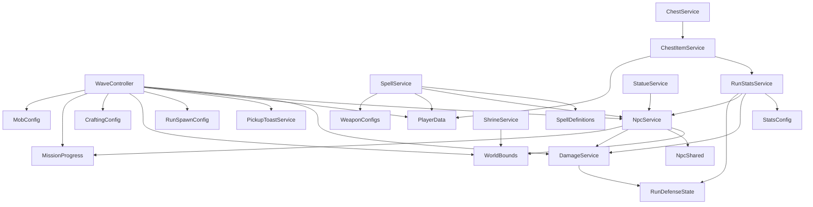
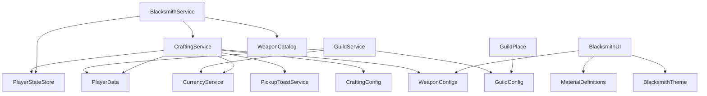

# God Script Refactor Plan

Data startu: 2026-07-01  
Zakres: etapowy refaktor największych God Scriptów i gameplayowych zależności przez `_G`.

## Status etapów

| Etap | Status | Zakres | Warunek przejścia |
|---|---|---|---|
| 0. Audyt i mapa zależności | Ukończony dla repo i aktywnych place `Level`/`Four Peaks`; `Guild` Studio nie było otwarte | Metryki plików, `_G`, `require`, pętle runtime, aktywne ścieżki Studio, plan migracji | Diff dokumentacji i changelog przechodzą walidację |
| 1. `ProgressService` i gameplayowe `_G` | Ukończony w zatwierdzonym zakresie Stage 1; etap 2 nie rozpoczęty | `RunProgressApi` zastąpił `_G` dla XP/coins/souls/kills/run time/average level/boss/end run; party XP declaration-order bug naprawiony; martwy `SetGlobalRunPause` fallback usunięty z chest itemów | Przed etapem 2 pozostaje tylko osobna akceptacja dalszego zakresu i pełniejszy runtime test, jeżeli dostępny będzie multiplayer |
| 2. `WaveController` | Zaplanowany | Najpierw geometria ability, hazard zones, execution boss/elite | Brak zmian damage/tick/cooldown/spawn rate |
| 3. `NpcService` | Zaplanowany | Registry/lifecycle, targeting/steering/combat/replication tylko po potwierdzeniu granic | Jeden centralny update, brak per-NPC Heartbeat |
| 4. `SpellService` i projectiles | Zaplanowany | Centralny projectile service, targeting/effects/VFX dispatch | Jedno połączenie runtime dla pocisków |
| 5. `RunStatsService` i `ShrineService` | Zaplanowany | Tylko pozostałe realnie mieszane odpowiedzialności | DamageService i RunDefenseState bez zmiany ownership |
| 6. Guild | Zablokowany do czasu otwarcia `Guild` Studio | Persistence, membership, treasury, upgrades, teleport | Potwierdzony aktywny place `Gildia` |
| 7. Duże kontrolery UI | Zaplanowany | Inventory/blacksmith/crafting UI po stabilizacji serwera | Brak zmian wyglądu/remotes/bindów |

## Aktywne ścieżki Studio

Potwierdzone przez MCP 2026-07-01:

| Place | Studio | Aktywne ścieżki |
|---|---|---|
| Level | `Level` | `ServerScriptService.Script.ProgressService`, `ServerScriptService.Script.Model.WaveController`, `ServerScriptService.ModuleScript.NpcService`, `ServerScriptService.ModuleScript.Stats.RunStatsService`, `ServerScriptService.Script.SpellService`, `ServerScriptService.Script.ShrineService`, `ServerScriptService.Script.DropService`, `ServerScriptService.ModuleScript.DamageService` |
| Four Peaks | `Four Peaks` | `ServerScriptService.ModuleScript.GuildService`, `ServerScriptService.ModuleScript.CraftingService`, `ServerScriptService.Script.BlacksmithService`, `StarterPlayer.StarterPlayerScripts.InventoryController`, `StarterPlayer.StarterPlayerScripts.BlacksmithUI`, `StarterPlayer.StarterPlayerScripts.GuildClient` |
| Guild | niedostępny | `Guild/` przeanalizowano tylko z repo; przed etapem 6 trzeba otworzyć i ustawić Studio `Gildia` |

Uwagi o parity:

- `Level/ServerScriptService/Script/Model/WaveController.lua` jest aktywnym mirrorem. Stale `Model.model/WaveController.lua` został usunięty w poprzednim etapie damage.
- `Four Peaks/StarterPlayer/StarterPlayerScripts/BlacksmithUI.lua` jest aktywną ścieżką Studio. `Four Peaks/StarterPlayer/StarterPlayerScripts/LocalScript/BlacksmithUI.lua` istnieje w repo jako rozjechana kopia i nie wolno jej aktualizować w ciemno.
- `script_grep` w Studio potwierdził aktywne `_G` w `Level` i `Four Peaks`; przed każdą migracją trzeba ponownie sprawdzić konkretną dotykaną ścieżkę.
- 2026-07-02: Stage 1 party XP fix verified `ProgressService` repo/Studio parity. MCP Play validated the Multi party award branch through `RunProgressApi.AwardPlayer`, no double award, Solo follow-up, and spell offer/pick flow. Full two-client multiplayer and natural normal/elite/boss kill runtime remain unverified because current MCP Play controls do not expose a true multi-client session.

## Metryki największych plików

Liczby są statycznym skanem repo. `Remote names` to unikalne publiczne remotes jawnie używane przez plik, bez nazw klas i payloadów.

| Plik | Linie | Local/public functions | `require` | Remote names | Runtime loops i connections | `_G` reads/writes |
|---|---:|---:|---:|---|---|---:|
| `Level/ServerScriptService/Script/Model/WaveController.lua` | 2623 | 102 / 11 | 9 | `WaveStatusEvent` | 1 `Heartbeat`; liczne `task.delay`; hazard tick taski; 10 `:Connect` | 20 / 11 |
| `Four Peaks/StarterPlayer/StarterPlayerScripts/InventoryController.lua` | 2565 | 74 / 4 | 0 | `InventoryAction`, `InventorySync`, `RF_GetInventorySnapshot`, `PlayerProgressEvent` | event-driven UI, 28 connections, krótkie `task.delay` refresh | 0 / 0 |
| `Level/ServerScriptService/ModuleScript/NpcService.lua` | 1666 | 60 / 20 | 4 | `NpcBatchEvent`, `NpcSyncRequest`, `DamageIndicatorEvent` | 1 `Heartbeat`, 1 remote connection | 0 / 0 |
| `Level/ServerScriptService/Script/ProgressService.lua` | 1645 | 56 / 7 | 0 | `PlayerProgressEvent`, `MissionSummaryEvent`, `SpellEvent`, `PauseMenuEvent` | character health watch task co 0.25 s; remote/player connections | 4 / 8 |
| `Four Peaks/StarterPlayer/StarterPlayerScripts/BlacksmithUI.lua` | 1631 | 68 / 0 | 3 | `OpenBlacksmithUI`, `BlacksmithSync`, `BlacksmithAction` | event-driven UI, 18 connections | 0 / 0 |
| `Four Peaks/ServerScriptService/ModuleScript/GuildService.lua` | 1503 | 52 / 23 | 3 | `GuildUpdated`, `TeleportStatus` | no frame loop; 1 player removing connection | 0 / 0 |
| `Guild/ServerScriptService/Script/GuildPlace.server.lua` | 1422 | 63 / 4 | 1 | `GetGuildCastleState`, `GetTreasury`, `DepositToTreasury`, `SpendFromTreasury`, `GuildLocationOpened`, `GuildTreasuryUpdated`, `LobbyReturnStatus`, `RequestLobbyReturn` | no frame loop; prompt/player/remote connections | 0 / 0 |
| `Four Peaks/ServerScriptService/ModuleScript/CraftingService.lua` | 1287 | 41 / 16 | 6 | none | no runtime loop | 0 / 0 |
| `Level/ServerScriptService/Script/SpellService.lua` | 1280 | 68 / 0 | 4 | `SpellVFXEvent` | per-projectile `Heartbeat`; global spell `Heartbeat`; beam/zone/orbit task loops | 0 / 0 |
| `Level/ServerScriptService/Script/ShrineService.server.lua` | 651 | 19 / 1 | 1 | `WaveStatusEvent` | 1 `Heartbeat`, player/run connections | 0 / 1 |
| `Level/ServerScriptService/ModuleScript/Stats/RunStatsService.lua` | 462 | 14 / 16 | 4 | none | 1 `Heartbeat`, player/run connections | 0 / 2 |
| `Four Peaks/ServerScriptService/Script/BlacksmithService.lua` | 312 | 12 / 0 | 3 | `OpenBlacksmithUI`, `BlacksmithSync`, `BlacksmithAction` | prompt/workspace/player/remote connections | 0 / 0 |

Repo-wide scan:

- `_G.` occurrences: present in Level gameplay, Four Peaks spellbook hooks, and error reporter debug hooks.
- `_G[...]`: only dynamic reads in `RunReadyGate.server.lua` and `StatueService.server.lua`.
- `rawget(_G`, `rawset(_G`, `shared.`, `getfenv`, `setfenv`: no current source matches.

## Gameplayowe `_G`

| Global | Writer | Aktywni callerzy | Kontrakt obecny | Docelowe API |
|---|---|---|---|---|
| `_G.AwardPlayer` | `ProgressService`, wrapped by `WaveController` InfoUI counter | `DropService`, `ChestItemService`, `DebugCommandService`, `WaveController` wrapper | Award XP and run coins; supports party XP; syncs HUD/missions | `RunRewardService.AwardPlayer(player, xp, coins)` plus explicit InfoUI counter callback/event |
| `_G.AwardSouls` | `ProgressService` | `DropService`, `ChestItemService` | Add persistent souls, mark dirty, sync HUD | `RunRewardService.AwardSouls(player, souls)` |
| `_G.TrySpendRunCoins` | `ProgressService` | `ChestService` | Spend run-only coins and sync HUD | `RunWalletService.TrySpendRunCoins(player, coins)` |
| `_G.GetRunCoins` | `ProgressService` | no repo caller | Read run-only coins | Keep only if a real caller appears; otherwise remove after Studio grep |
| `_G.RegisterEnemyKill` | `ProgressService`, wrapped by `WaveController` InfoUI counter | `WaveController` death path | Increment kill counters, mission progress, HUD | `RunKillService.RegisterEnemyKill(pos, killer)`; InfoUI should subscribe/call explicit counter |
| `_G.NotifyBossSpawn` | `ProgressService` | `WaveController` boss path | Start boss no-hit timing for all active players | `RunBossTracker.NotifyBossSpawn(runSeconds?)` |
| `_G.GetAverageRunLevel` | `ProgressService` | `WaveController` scaling | Average active run level | `RunProgressQuery.GetAverageRunLevel()` |
| `_G.GetRunSeconds` | `WaveController` | `WaveController`, `ProgressService`, `StatueService` | Global elapsed seconds from WaveController clock | `RunClockService.GetRunSeconds()` owned by run clock/start gate |
| `_G.EndRunForPlayer` | `ProgressService` | `WaveController`, `RunDeathHandler`, `ReturnToLobby` | Finalize run, save, summary, mission completion | `RunEndService.EndRunForPlayer(player, reason)` |
| `_G.EndRun` | no writer in repo/live grep | fallback reads in `WaveController`, `RunDeathHandler` | Legacy fallback | Remove fallback after direct `EndRunForPlayer` migration |
| `_G.SetGlobalRunPause` | no writer in repo/live grep | `ChestItemService` optional fallback | Intended global pause source toggle; currently falls back to `PauseState.Value` | `RunPauseService.SetSource(source, active)` or module API used by Progress/Chest |
| `_G.SpawnDropsAt` | `DropService` | `WaveController` | Spawn XP/coin/soul drops at position | `DropService.SpawnDropsAt(pos, xp, coins, souls)` after converting `DropService` to ModuleScript or adding domain module |
| `_G.ActivateGlobalMagnet` | `DropService` | no repo caller | Timed global magnet for a player | Remove if no active Studio caller; otherwise `DropMagnetService.Activate(player, duration)` |
| `_G.SpawnEnemyBurst` | `WaveController` | `StatueService` | Spawn enemies near anchor for statue events/debug-like burst | `EncounterSpawnService.SpawnEnemyBurst(...)` |
| `_G.SpawnRewardChestForPlayer` | `ChestService` | `StatueService` | Spawn reward chest for player at position | `ChestSpawnService.SpawnRewardChestForPlayer(...)` |
| `_G.PrepareRunChests` | `ChestService` | `RunReadyGate` dynamic `_G[name]` | Prepare chest objects before run | `RunWorldPreparation.PrepareChests()` |
| `_G.PrepareRunShrines` | `ShrineService` | `RunReadyGate` dynamic `_G[name]` | Prepare shrine objects before run | `RunWorldPreparation.PrepareShrines()` |
| `_G.PrepareRunStructures` | `StatueService` | `RunReadyGate` dynamic `_G[name]` | Prepare statue/structure objects before run | `RunWorldPreparation.PrepareStructures()` |
| `_G.GetRunStat`, `_G.HealRunPlayer` | `RunStatsService` | no repo caller | Stat query and heal helper | Remove after Studio grep, or replace with `RunStatsService` direct calls |
| `_G.Debug*` WaveController hooks | `WaveController` | `DebugCommandService` | Studio/debug spawn toggles | Keep as Studio/debug-only until a debug command module owns them |
| `_G.Spells_*` | Four Peaks `SpellService` | `WitchNPC` and no-call helpers | Spellbook unlock/reset/open choice hooks | Later lobby spell API module; not part of Level etap 1 |
| `_G.ErrorReporterTest`, `_G.ErrorWebhookTest` | ErrorBootstrap | debug commands | Error reporter diagnostics | Out of scope for gameplay refactor |
| `_G.OnUpgradeChosen` | `MultiLevelUpClient` | no repo caller | Client-side hook | Treat separately with UI cleanup |

## Obecny graf `require()`

Level:

Four Peaks / Guild:

Potencjalne cykle do uniknięcia:

- Nie wolno migrować callerów przez `require(ProgressService)`, bo `ProgressService` jest `Script`, tworzy remotes i ma startup side effects.
- Nowe API progresu powinno siedzieć w modułach domenowych pod `ServerScriptService.ModuleScript`, a `ProgressService` powinien je bootstrapować albo używać jako koordynator.
- `ChestItemService -> RunStatsService -> NpcService -> DamageService -> RunDefenseState` już jest łańcuchem zależności; nie dodawać powrotnej zależności z `NpcService`/`DamageService` do rewardów/progresu.
- `WaveController -> NpcService` i `SpellService -> NpcService` oznacza, że moduły ability/projectile mogą zależeć od `NpcService`, ale `NpcService` nie może zależeć od ability/spell/wave.
- `DropService` i `ChestService` są `Script` bootstrapami; przed zastąpieniem `_G` trzeba wydzielić mały moduł API albo przenieść stan do domenowego ModuleScriptu bez zmiany nazw remotes.

## Docelowe granice odpowiedzialności

Etap 1, Progress:

- `RunClockService`: start/pause elapsed time, `GetRunSeconds`.
- `RunWalletService`: run coins, spend, earned counters.
- `RunRewardService`: XP/coins/souls award, party XP handoff.
- `RunKillService`: kill counters, multikill mission progress.
- `RunBossTracker`: boss spawn/no-hit timing.
- `RunEndService`: finalization, mission summary, save/teleport-adjacent handoff.
- `RunPauseService`: named pause sources for chest/upgrades/pause menu.

Nazwy są robocze; przed implementacją etapu 1 trzeba wybrać najmniejszy moduł, który usuwa realny `_G` bez tworzenia nowego God Service.

Etap 2, Wave:

- Najpierw czyste helpery geometrii ability: radius, line, cone, ground query.
- Potem hazard zones z zachowaniem tick rate/damage/duration.
- Dopiero później boss/elite ability execution, spawn/scheduling, portal/end encounter.

Etap 3, NPC:

- `NpcService` zostaje właścicielem symulacji NPC do czasu wydzielenia jasnych modułów.
- Kandydaci: registry/lifecycle, targeting, steering/grounding, melee combat, status effects, replication.
- Główny `Heartbeat` pozostaje centralny; żadnych per-NPC połączeń.

Etap 4, Spell/projectiles:

- Centralny projectile owner z jedną pętlą.
- `SpellService` powinien koordynować cast/scheduler i delegować projectile simulation/hit detection.
- Nie zmieniać prędkości, range, damage, cooldown, VFX payloadów.

Etapy 5-7:

- Refaktor tylko jeśli po etapach 1-4 nadal pozostają mieszane odpowiedzialności.
- Guild dopiero po otwarciu Studio `Gildia`.
- UI na końcu, bez zmian wyglądu ani nazw obiektów.

## Plan migracji `_G`

### Aktualizacja 2026-07-01 po etapie 1

Zmigrowane z aktywnego `Level` do jawnego `RunProgressApi`:

- `AwardPlayer`,
- `AwardSouls`,
- `TrySpendRunCoins`,
- `GetRunCoins`,
- `RegisterEnemyKill`,
- `NotifyBossSpawn`,
- `GetAverageRunLevel`,
- `GetRunSeconds`,
- `EndRunForPlayer`.

Usunięto też repo/live callerów legacy fallbacków:

- `_G.EndRun`,
- `_G.SetGlobalRunPause`.

Pozostałe gameplayowe `_G` w `Level` po tym kroku:

- `DropService`: `_G.SpawnDropsAt`, `_G.ActivateGlobalMagnet`,
- `ChestService`: `_G.PrepareRunChests`, `_G.SpawnRewardChestForPlayer`,
- `ShrineService`: `_G.PrepareRunShrines`,
- `StatueService`: `_G.PrepareRunStructures`, dynamiczne `_G[name]` call site’y i odczyty spawn/chest hooków,
- `WaveController`: `_G.SpawnEnemyBurst`, debug-only `_G.Debug*`,
- `RunStatsService`: `_G.GetRunStat`, `_G.HealRunPlayer` bez repo/live callerów poza writerami.

Walidacja etapu 1:

- Repo grep i Studio grep nie znajdują już `_G.AwardPlayer`, `_G.AwardSouls`, `_G.TrySpendRunCoins`, `_G.GetRunCoins`, `_G.RegisterEnemyKill`, `_G.NotifyBossSpawn`, `_G.GetAverageRunLevel`, `_G.GetRunSeconds`, `_G.EndRunForPlayer`, `_G.EndRun`, `_G.SetGlobalRunPause`.
- Play startup smoke w `Level` przeszedł po poprawce limitu lokalnych rejestrów `WaveController`.
- Nie wykonano pełnych testów kill/XP/drop/chest/end-run, więc etap 2 nie powinien startować przed ich wykonaniem.

1. Najpierw usunąć read-only fallbacki bez writera (`EndRun`, `SetGlobalRunPause`, nieużywane `GetRunCoins`/`GetRunStat`/`HealRunPlayer`) tylko po Studio grep i Play test.
2. Wydzielić najmniejszy moduł dla run rewards/wallet/kill query, który nie wymaga zależności zwrotnej do `WaveController`, `NpcService`, `DamageService` ani `ChestItemService`.
3. Zmigrować callerów w kolejności najmniejszego ryzyka:
   - `ChestService` spend coins,
   - `ChestItemService` reward fallback/pause,
   - `DropService` award calls,
   - `WaveController` kill/reward/end-run calls,
   - `RunDeathHandler` i `ReturnToLobby` end-run calls.
4. Po każdym call site: repo grep, Studio grep, compile/play smoke.
5. Usunąć shimy w tym samym całym zadaniu, gdy aktywni callerzy znikną.

## Testy regresji

Level smoke:

- start runu i `RunStarted`,
- run timer,
- zwykły kill, elite kill, boss kill,
- XP, party XP i level-up offer,
- wybór/skip/reroll/banish spella,
- coins/souls/drop pickup,
- chest reward i spend run coins,
- shrine/statue preparation przez `RunReadyGate`,
- end run victory/defeat/manual return,
- save/summary/teleport status,
- reconnect/PlayerAdded path jeśli możliwe.

Wave/NPC/Spell:

- normal wave, elite, boss,
- radius/line/cone/multi-hit/hazard/arena pressure,
- spawn cap i difficulty scaling bez zmiany częstotliwości,
- NPC targeting, movement, obstacle avoidance, melee cooldown, DamageService, armor/shield/evasion/thorns/status effects/drop,
- projectile archetypes i brak rosnącej liczby `Heartbeat`.

Four Peaks/Guild/UI:

- inventory open/close/sync/sort/filter/select/equip/favorite/sell,
- blacksmith open/close/craft/upgrade/equip/sell/material tooltip,
- guild create/join/invite/leave/kick/roles/treasury/upgrades/tasks/teleport/reload, dopiero po Studio `Gildia`.

## Ryzyka i rollback

- Największe ryzyko etapu 1 to kolejność startu: obecne `_G` działa dzięki późnemu wiązaniu. Nowe moduły muszą mieć jawny bootstrap bez cyklu.
- `WaveController` zawija `_G.RegisterEnemyKill` i `_G.AwardPlayer` dla liczników InfoUI. Migracja musi zachować te liczniki albo przenieść je do jawnego callbacku.
- `ChestItemService` ma fallback do bezpośredniego `PauseState.Value`, bo `_G.SetGlobalRunPause` nie ma writera. Zmiana pause wymaga testu chest reward flow.
- `DropService` jest `Script` ze stanem aktywnych dropów. Proste `require(DropService)` nie jest opcją; trzeba wydzielić stateful module albo API pod kontrolą bootstrapu.
- Rollback każdego etapu: przywrócić zmienione pliki z poprzedniego commita, przywrócić live Studio source przez MCP `multi_edit`, cofnąć wpis changeloga i uruchomić smoke test tego etapu.

## Walidacja etapu 0

- Zmieniane pliki etapu 0: tylko ten dokument oraz changelog/index.
- Brak zmian runtime, brak nowych pętli, brak nowych `_G`, brak zmian remotes/persistent/teleport.
- Testy wymagane dla etapu 0: `git diff --check`, przegląd diffu, `git status --short`.
- Elementy nieweryfikowane: Play test, compile skryptów runtime, `Guild` Studio.
