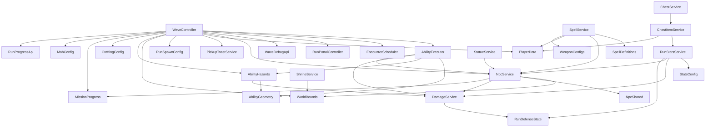
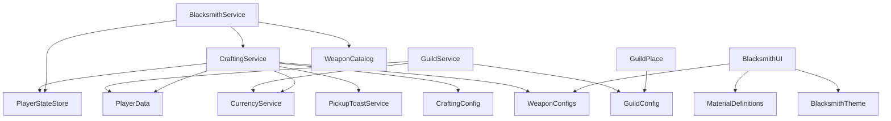

# God Script Refactor Plan

Data startu: 2026-07-01  
Zakres: etapowy refaktor największych God Scriptów i gameplayowych zależności przez `_G`.

## Status etapów

| Etap | Status | Zakres | Warunek przejścia |
|---|---|---|---|
| 0. Audyt i mapa zależności | Ukończony dla repo i aktywnych place `Level`/`Four Peaks`; `Guild` Studio nie było otwarte | Metryki plików, `_G`, `require`, pętle runtime, aktywne ścieżki Studio, plan migracji | Diff dokumentacji i changelog przechodzą walidację |
| 1. `ProgressService` i gameplayowe `_G` | Ukończony w zatwierdzonym zakresie Stage 1; etap 2 nie rozpoczęty | `RunProgressApi` zastąpił `_G` dla XP/coins/souls/kills/run time/average level/boss/end run; party XP declaration-order bug naprawiony; martwy `SetGlobalRunPause` fallback usunięty z chest itemów | Przed etapem 2 pozostaje tylko osobna akceptacja dalszego zakresu i pełniejszy runtime test, jeżeli dostępny będzie multiplayer |
| 2. `WaveController` | 2A-2E ukończone | `AbilityGeometry` wydziela czystą geometrię ability; `AbilityHazards` wydziela hazard zones/ticki/cleanup; `AbilityExecutor` wydziela wykonanie ability elit i bossów; `EncounterScheduler` wydziela planowanie spawn/encounter; `RunPortalController` wydziela portal/prompt state; `WaveDebugApi` wydziela Studio-only debug hook registration | Brak zmian damage/tick/cooldown/spawn rate; po każdym podetapie Play test |
| 3. `NpcService` | 3A-3D ukończone; 3E następny | Registry/lifecycle, movement/steering/ground oraz targeting/melee wydzielone; status/death/despawn następne | Jeden centralny update, brak per-NPC Heartbeat |
| 4. `SpellService` i projectiles | Zaplanowany | Centralny projectile service, targeting/effects/VFX dispatch | Jedno połączenie runtime dla pocisków |
| 5. `RunStatsService` i `ShrineService` | Zaplanowany | Tylko pozostałe realnie mieszane odpowiedzialności | DamageService i RunDefenseState bez zmiany ownership |
| 6. Guild | Zablokowany do czasu otwarcia `Guild` Studio | Persistence, membership, treasury, upgrades, teleport | Potwierdzony aktywny place `Gildia` |
| 7. Duże kontrolery UI | Zaplanowany | Inventory/blacksmith/crafting UI po stabilizacji serwera | Brak zmian wyglądu/remotes/bindów |

## Aktywne ścieżki Studio

Potwierdzone przez MCP 2026-07-01:

| Place | Studio | Aktywne ścieżki |
|---|---|---|
| Level | `Level` | `ServerScriptService.Script.ProgressService`, `ServerScriptService.Script.Model.WaveController`, `ServerScriptService.ModuleScript.NpcService`, `ServerScriptService.ModuleScript.Stats.RunStatsService`, `ServerScriptService.Script.SpellService`, `ServerScriptService.Script.ShrineService`, `ServerScriptService.Script.DropService`, `ServerScriptService.ModuleScript.DamageService` |
| Four Peaks | `Four Peaks` | `ServerScriptService.ModuleScript.GuildService`, `ServerScriptService.ModuleScript.CraftingService`, `ServerScriptService.Script.BlacksmithService`, `StarterPlayer.StarterPlayerScripts.InventoryController`, `StarterPlayer.StarterPlayerScripts.BlacksmithUI`, `StarterPlayer.StarterPlayerScripts.GuildClient` |
| Guild | niedostępny | `Guild/` przeanalizowano tylko z repo; przed etapem 6 trzeba otworzyć i ustawić Studio `Gildia` |

Uwagi o parity:

- `Level/ServerScriptService/Script/Model/WaveController.lua` jest aktywnym mirrorem. Stale `Model.model/WaveController.lua` został usunięty w poprzednim etapie damage.
- `Four Peaks/StarterPlayer/StarterPlayerScripts/BlacksmithUI.lua` jest aktywną ścieżką Studio. `Four Peaks/StarterPlayer/StarterPlayerScripts/LocalScript/BlacksmithUI.lua` istnieje w repo jako rozjechana kopia i nie wolno jej aktualizować w ciemno.
- `script_grep` w Studio potwierdził aktywne `_G` w `Level` i `Four Peaks`; przed każdą migracją trzeba ponownie sprawdzić konkretną dotykaną ścieżkę.
- 2026-07-02: Stage 1 party XP fix verified `ProgressService` repo/Studio parity. MCP Play validated the Multi party award branch through `RunProgressApi.AwardPlayer`, no double award, Solo follow-up, and spell offer/pick flow. Full two-client multiplayer and natural normal/elite/boss kill runtime remain unverified because current MCP Play controls do not expose a true multi-client session.
- 2026-07-02: Stage 2A verified `WaveController` repo/Studio parity after extracting `AbilityGeometry`. Stale `Model.model/WaveController.lua` remains absent.
- 2026-07-02: Stage 2B verified `WaveController`, `AbilityGeometry`, and `AbilityHazards` repo/Studio parity after extracting hazard zone lifecycle. Temporary Play probes were removed from Studio.
- 2026-07-02: Stage 2C verified `WaveController`, `AbilityExecutor`, `AbilityGeometry`, and `AbilityHazards` repo/Studio parity after extracting ability execution. Temporary Play probes were removed from Studio.
- 2026-07-07: Stage 2D verified `WaveController` and `EncounterScheduler` after extracting encounter scheduling. Temporary Play probes were removed from Studio.
- 2026-07-07: Stage 2E verified `WaveController`, `RunPortalController`, and `WaveDebugApi` after extracting portal/prompt state and Studio-only debug hook registration. Temporary Play probes were removed from Studio.
- 2026-07-07: Stage 3A verified active `NpcService`, captured baseline metrics, and mirrored live Studio ground/visual repair behavior into the repo before any Stage 3 split. Temporary Play probes were removed from Studio.
- 2026-07-07: Stage 3B added `NpcRegistry` and moved NPC id/model maps plus tombstones behind a neutral registry module. `NpcService` remains the public facade and single central scheduler owner.
- 2026-07-07: Stage 3C added `NpcMovement` and moved NPC movement math, ground sampling, spawn emerge, visual repair, model translation, and obstacle steering out of `NpcService`. `NpcService` still owns the single central scheduler.
- 2026-07-07: Stage 3D added `NpcTargeting` and `NpcMelee` for player targeting, target priority metrics, engagement slots, melee height/range validation, and contact damage dispatch. `NpcService` still owns the public API and single central scheduler.

## Metryki największych plików

Liczby są statycznym skanem repo. `Remote names` to unikalne publiczne remotes jawnie używane przez plik, bez nazw klas i payloadów.

| Plik | Linie | Local/public functions | `require` | Remote names | Runtime loops i connections | `_G` reads/writes |
|---|---:|---:|---:|---|---|---:|
| `Level/ServerScriptService/Script/Model/WaveController.lua` | 2576 | 101 / 11 | 10 | `WaveStatusEvent` | 1 `Heartbeat`; liczne `task.delay`; hazard tick taski; 10 `:Connect` | 20 / 11 |
| `Four Peaks/StarterPlayer/StarterPlayerScripts/InventoryController.lua` | 2565 | 74 / 4 | 0 | `InventoryAction`, `InventorySync`, `RF_GetInventorySnapshot`, `PlayerProgressEvent` | event-driven UI, 28 connections, krótkie `task.delay` refresh | 0 / 0 |
| `Level/ServerScriptService/ModuleScript/NpcService.lua` | 1087 | 27 / 20 | 6 | `NpcBatchEvent`, `NpcSyncRequest`, `DamageIndicatorEvent` | 1 `Heartbeat`, 1 remote connection | 0 / 0 |
| `Level/ServerScriptService/ModuleScript/NpcMovement.lua` | 401 | 11 / 15 | 1 | none | no runtime loop or connection | 0 / 0 |
| `Level/ServerScriptService/ModuleScript/NpcTargeting.lua` | 191 | 0 / 9 | 1 | none | no runtime loop or connection | 0 / 0 |
| `Level/ServerScriptService/ModuleScript/NpcMelee.lua` | 105 | 3 / 2 | 1 | none | no runtime loop or connection | 0 / 0 |
| `Level/ServerScriptService/Script/ProgressService.lua` | 1645 | 56 / 7 | 0 | `PlayerProgressEvent`, `MissionSummaryEvent`, `SpellEvent`, `PauseMenuEvent` | character health watch task co 0.25 s; remote/player connections | 4 / 8 |
| `Four Peaks/StarterPlayer/StarterPlayerScripts/BlacksmithUI.lua` | 1631 | 68 / 0 | 3 | `OpenBlacksmithUI`, `BlacksmithSync`, `BlacksmithAction` | event-driven UI, 18 connections | 0 / 0 |
| `Four Peaks/ServerScriptService/ModuleScript/GuildService.lua` | 1503 | 52 / 23 | 3 | `GuildUpdated`, `TeleportStatus` | no frame loop; 1 player removing connection | 0 / 0 |
| `Guild/ServerScriptService/Script/GuildPlace.server.lua` | 1422 | 63 / 4 | 1 | `GetGuildCastleState`, `GetTreasury`, `DepositToTreasury`, `SpendFromTreasury`, `GuildLocationOpened`, `GuildTreasuryUpdated`, `LobbyReturnStatus`, `RequestLobbyReturn` | no frame loop; prompt/player/remote connections | 0 / 0 |
| `Four Peaks/ServerScriptService/ModuleScript/CraftingService.lua` | 1287 | 41 / 16 | 6 | none | no runtime loop | 0 / 0 |
| `Level/ServerScriptService/Script/SpellService.lua` | 1280 | 68 / 0 | 4 | `SpellVFXEvent` | per-projectile `Heartbeat`; global spell `Heartbeat`; beam/zone/orbit task loops | 0 / 0 |
| `Level/ServerScriptService/Script/ShrineService.server.lua` | 651 | 19 / 1 | 1 | `WaveStatusEvent` | 1 `Heartbeat`, player/run connections | 0 / 1 |
| `Level/ServerScriptService/ModuleScript/Stats/RunStatsService.lua` | 462 | 14 / 16 | 4 | none | 1 `Heartbeat`, player/run connections | 0 / 2 |
| `Four Peaks/ServerScriptService/Script/BlacksmithService.lua` | 312 | 12 / 0 | 3 | `OpenBlacksmithUI`, `BlacksmithSync`, `BlacksmithAction` | prompt/workspace/player/remote connections | 0 / 0 |

Repo-wide scan:

- `_G.` occurrences: present in Level gameplay, Four Peaks spellbook hooks, and error reporter debug hooks.
- `_G[...]`: only dynamic reads in `RunReadyGate.server.lua` and `StatueService.server.lua`.
- `rawget(_G`, `rawset(_G`, `shared.`, `getfenv`, `setfenv`: no current source matches.

## Gameplayowe `_G`

| Global | Writer | Aktywni callerzy | Kontrakt obecny | Docelowe API |
|---|---|---|---|---|
| `_G.AwardPlayer` | `ProgressService`, wrapped by `WaveController` InfoUI counter | `DropService`, `ChestItemService`, `DebugCommandService`, `WaveController` wrapper | Award XP and run coins; supports party XP; syncs HUD/missions | `RunRewardService.AwardPlayer(player, xp, coins)` plus explicit InfoUI counter callback/event |
| `_G.AwardSouls` | `ProgressService` | `DropService`, `ChestItemService` | Add persistent souls, mark dirty, sync HUD | `RunRewardService.AwardSouls(player, souls)` |
| `_G.TrySpendRunCoins` | `ProgressService` | `ChestService` | Spend run-only coins and sync HUD | `RunWalletService.TrySpendRunCoins(player, coins)` |
| `_G.GetRunCoins` | `ProgressService` | no repo caller | Read run-only coins | Keep only if a real caller appears; otherwise remove after Studio grep |
| `_G.RegisterEnemyKill` | `ProgressService`, wrapped by `WaveController` InfoUI counter | `WaveController` death path | Increment kill counters, mission progress, HUD | `RunKillService.RegisterEnemyKill(pos, killer)`; InfoUI should subscribe/call explicit counter |
| `_G.NotifyBossSpawn` | `ProgressService` | `WaveController` boss path | Start boss no-hit timing for all active players | `RunBossTracker.NotifyBossSpawn(runSeconds?)` |
| `_G.GetAverageRunLevel` | `ProgressService` | `WaveController` scaling | Average active run level | `RunProgressQuery.GetAverageRunLevel()` |
| `_G.GetRunSeconds` | `WaveController` | `WaveController`, `ProgressService`, `StatueService` | Global elapsed seconds from WaveController clock | `RunClockService.GetRunSeconds()` owned by run clock/start gate |
| `_G.EndRunForPlayer` | `ProgressService` | `WaveController`, `RunDeathHandler`, `ReturnToLobby` | Finalize run, save, summary, mission completion | `RunEndService.EndRunForPlayer(player, reason)` |
| `_G.EndRun` | no writer in repo/live grep | fallback reads in `WaveController`, `RunDeathHandler` | Legacy fallback | Remove fallback after direct `EndRunForPlayer` migration |
| `_G.SetGlobalRunPause` | no writer in repo/live grep | `ChestItemService` optional fallback | Intended global pause source toggle; currently falls back to `PauseState.Value` | `RunPauseService.SetSource(source, active)` or module API used by Progress/Chest |
| `_G.SpawnDropsAt` | `DropService` | `WaveController` | Spawn XP/coin/soul drops at position | `DropService.SpawnDropsAt(pos, xp, coins, souls)` after converting `DropService` to ModuleScript or adding domain module |
| `_G.ActivateGlobalMagnet` | `DropService` | no repo caller | Timed global magnet for a player | Remove if no active Studio caller; otherwise `DropMagnetService.Activate(player, duration)` |
| `_G.SpawnEnemyBurst` | `WaveController` | `StatueService` | Spawn enemies near anchor for statue events/debug-like burst | `EncounterSpawnService.SpawnEnemyBurst(...)` |
| `_G.SpawnRewardChestForPlayer` | `ChestService` | `StatueService` | Spawn reward chest for player at position | `ChestSpawnService.SpawnRewardChestForPlayer(...)` |
| `_G.PrepareRunChests` | `ChestService` | `RunReadyGate` dynamic `_G[name]` | Prepare chest objects before run | `RunWorldPreparation.PrepareChests()` |
| `_G.PrepareRunShrines` | `ShrineService` | `RunReadyGate` dynamic `_G[name]` | Prepare shrine objects before run | `RunWorldPreparation.PrepareShrines()` |
| `_G.PrepareRunStructures` | `StatueService` | `RunReadyGate` dynamic `_G[name]` | Prepare statue/structure objects before run | `RunWorldPreparation.PrepareStructures()` |
| `_G.GetRunStat`, `_G.HealRunPlayer` | `RunStatsService` | no repo caller | Stat query and heal helper | Remove after Studio grep, or replace with `RunStatsService` direct calls |
| `_G.Debug*` WaveController hooks | `WaveController` | `DebugCommandService` | Studio/debug spawn toggles | Keep as Studio/debug-only until a debug command module owns them |
| `_G.Spells_*` | Four Peaks `SpellService` | `WitchNPC` and no-call helpers | Spellbook unlock/reset/open choice hooks | Later lobby spell API module; not part of Level etap 1 |
| `_G.ErrorReporterTest`, `_G.ErrorWebhookTest` | ErrorBootstrap | debug commands | Error reporter diagnostics | Out of scope for gameplay refactor |
| `_G.OnUpgradeChosen` | `MultiLevelUpClient` | no repo caller | Client-side hook | Treat separately with UI cleanup |

## Obecny graf `require()`

Level:

Four Peaks / Guild:

Potencjalne cykle do uniknięcia:

- Nie wolno migrować callerów przez `require(ProgressService)`, bo `ProgressService` jest `Script`, tworzy remotes i ma startup side effects.
- Nowe API progresu powinno siedzieć w modułach domenowych pod `ServerScriptService.ModuleScript`, a `ProgressService` powinien je bootstrapować albo używać jako koordynator.
- `ChestItemService -> RunStatsService -> NpcService -> DamageService -> RunDefenseState` już jest łańcuchem zależności; nie dodawać powrotnej zależności z `NpcService`/`DamageService` do rewardów/progresu.
- `WaveController -> NpcService` i `SpellService -> NpcService` oznacza, że moduły ability/projectile mogą zależeć od `NpcService`, ale `NpcService` nie może zależeć od ability/spell/wave.
- `DropService` i `ChestService` są `Script` bootstrapami; przed zastąpieniem `_G` trzeba wydzielić mały moduł API albo przenieść stan do domenowego ModuleScriptu bez zmiany nazw remotes.

## Docelowe granice odpowiedzialności

Etap 1, Progress:

- `RunClockService`: start/pause elapsed time, `GetRunSeconds`.
- `RunWalletService`: run coins, spend, earned counters.
- `RunRewardService`: XP/coins/souls award, party XP handoff.
- `RunKillService`: kill counters, multikill mission progress.
- `RunBossTracker`: boss spawn/no-hit timing.
- `RunEndService`: finalization, mission summary, save/teleport-adjacent handoff.
- `RunPauseService`: named pause sources for chest/upgrades/pause menu.

Nazwy są robocze; przed implementacją etapu 1 trzeba wybrać najmniejszy moduł, który usuwa realny `_G` bez tworzenia nowego God Service.

Etap 2, Wave:

- Najpierw czyste helpery geometrii ability: radius, line, cone, ground query.
- Potem hazard zones z zachowaniem tick rate/damage/duration.
- Dopiero później boss/elite ability execution, spawn/scheduling, portal/end encounter.

Status 2026-07-02:

- 2A ukończony.
- Dodano `Level/ServerScriptService/ModuleScript/AbilityGeometry.lua`.
- `AbilityGeometry` nie wymaga `WaveController`, `DamageService`, hazardów, executorów ani konfiguracji fal.
- Aktualny graf 2A: `WaveController -> AbilityGeometry`; brak zależności zwrotnej i brak cyklu.
- Przeniesione funkcje/operacje: `FlatVector`, `HorizontalDistance`, `VerticalDelta`, `Groundify`, `DistancePointToSegment`, `IsPointInRadius`, `IsPointAlongLine`, `IsPointInCone`.
- 2B ukończony.
- Dodano `Level/ServerScriptService/ModuleScript/AbilityHazards.lua`.
- `AbilityHazards` odpowiada za hazard zone part, tick loop, hazard radius damage przez `DamageService.Apply`, active-zone cleanup i `CancelAll`.
- Aktualny graf 2B: `WaveController -> AbilityHazards`, `AbilityHazards -> AbilityGeometry`, `AbilityHazards -> DamageService`; brak zależności zwrotnej do `WaveController`.
- `WaveController` nadal iteruje graczy dla jednorazowych ability, wywołuje `DamageService.Apply` dla non-hazard ability, tworzy non-hazard VFX, wybiera boss/elite ability i zarządza encounter state.
- Rozmiar po 2B: `WaveController` 2572 linie, `AbilityGeometry` 63 linie, `AbilityHazards` 171 linii.
- Pętle runtime po 2B: bez nowego `Heartbeat`; istniejący per-hazard `task.spawn` tick loop został przeniesiony z `WaveController` do `AbilityHazards` bez zmiany tick rate/duration.
- 2C ukończony.
- Dodano `Level/ServerScriptService/ModuleScript/AbilityExecutor.lua`.
- `AbilityExecutor` odpowiada za wykonanie archetypów ability elit i bossów, telegraph/burst VFX, opóźnione windupy, cooldown writes, wywołania damage ability i przekazanie hazardów do `AbilityHazards`.
- Aktualny graf 2C: `WaveController -> AbilityExecutor`; `AbilityExecutor -> AbilityGeometry`, `AbilityHazards`, `DamageService`, `NpcService`; `AbilityHazards -> AbilityGeometry`, `DamageService`; brak zależności zwrotnej do `WaveController`.
- `WaveController` nadal posiada konfiguracje ability, wybór ability/phase, spawn scheduling, portal/end state, rewardy i debug hooks.
- Rozmiar po 2C: `WaveController` 2087 linii, `AbilityExecutor` 573 linie, `AbilityGeometry` 63 linie, `AbilityHazards` 171 linii.
- Pętle runtime po 2C: bez nowego `Heartbeat`; istniejące `task.delay`/`task.spawn` windupów ability zostały przeniesione z `WaveController` do `AbilityExecutor` bez zmiany opóźnień, a per-hazard tick loop pozostał w `AbilityHazards`.
- Testy 2A: baseline przed/po dla radius/line/cone/groundify identyczny; Play test realnych ability potwierdził `GroundSlam`, `DashThrust` i `ShieldCone` hit/miss przez `WaveController -> AbilityGeometry`.
- Testy 2B: Play test realnych hazardów potwierdził `RootCage` ticki `3` z odstępami `0.8/0.8`, exit/enter, zatrzymanie po śmierci gracza, cleanup przy `RunStarted=false`, brak thorns bez `source`/`attacker`, oraz `ArenaPressure` ticki `3` z odstępami `0.8/0.8`.
- Testy 2C: Play test realnych call site'ów potwierdził `RockToss`, `DashThrust`, `ShieldCone`, `TripleCombo` z 3 trafieniami i odstępami około `0.26/0.28`, `RootCage` ticki `3` z odstępami `0.8/0.8`, `BoulderRain`, `Shockwave` przez `DamagePlayersInRadius`, oraz brak trafień po cleanupie castera przed opóźnionym `RockToss`.
- 2D ukończony.
- Dodano `Level/ServerScriptService/ModuleScript/EncounterScheduler.lua`.
- `EncounterScheduler` odpowiada za stan i obliczenia planowania encounterów: pool spawnu, scaling czasu, max alive, interval/burst, elite cadence, swarm windows, catch-up debt i trim normalnych mobów podczas important encounter.
- Aktualny graf 2D: `WaveController -> EncounterScheduler`; `EncounterScheduler` nie wymaga żadnych modułów i nie zależy zwrotnie od `WaveController`.
- `WaveController` nadal wykonuje faktyczne klonowanie mobów, pozycje spawnu, `NpcService.Register`, death/reward flow, portal/boss execution, ability stepping, debug hooks i pojedynczy `Heartbeat`.
- Rozmiar po 2D: `WaveController` 1888 linii, `EncounterScheduler` 407 linii, `AbilityExecutor` 573 linie, `AbilityGeometry` 63 linie, `AbilityHazards` 171 linii.
- Pętle runtime po 2D: bez nowego `Heartbeat` i bez nowej pętli schedulerowej; istniejący pojedynczy `RunService.Heartbeat` pozostał w `WaveController`, a scheduler tylko zwraca plany/liczby.
- Testy 2D: Play startup bez probe'a osiągnął `[HordeController] Ready`; tymczasowy probe potwierdził normal spawn `24/24` przy cap `100`, elite scheduler `1` spawn bez double, boss spawn, swarm `120/120` przy cap `120`, oraz cleanup `afterClearActive=0`.
- Zachowane wartości 2D: `ELITE_INTERVAL_SECONDS=300`, `SWARM_EVENT_TIMES={240,720}`, `SWARM_DURATION=60`, initial `maxAlive=24`, active cap `100`, swarm cap `120`; formuły interval/burst/overtime/catch-up/trim przeniesiono bez zmian balansu.
- 2E ukończony.
- Dodano `Level/ServerScriptService/ModuleScript/RunPortalController.lua`.
- Dodano `Level/ServerScriptService/ModuleScript/WaveDebugApi.lua`.
- `RunPortalController` odpowiada za model portalu, `ProximityPrompt`, stan aktywacji portalu i stan boss defeated; faktyczny boss spawn, rewardy i end-run nadal pozostają w `WaveController`.
- `WaveDebugApi` odpowiada za rejestrację debugowych `_G.Debug*` hooków wyłącznie w Studio; `WaveController` wymaga go tylko pod `RunService:IsStudio()`.
- Aktualny graf 2E: `WaveController -> RunPortalController`; `WaveController -> WaveDebugApi` tylko w Studio; nowe moduły nie wymagają `WaveController` i nie tworzą cyklu.
- Rozmiar po 2E: `WaveController` 1868 linii, `RunPortalController` 127 linii, `WaveDebugApi` 32 linie, `EncounterScheduler` 407 linii, `AbilityExecutor` 573 linie, `AbilityGeometry` 63 linie, `AbilityHazards` 171 linii.
- Pętle runtime po 2E: bez nowego `Heartbeat`, bez nowego schedulera i bez nowych pętli runtime; zachowany pojedynczy `RunService.Heartbeat` w `WaveController`.
- Testy 2E: Play startup bez probe'a osiągnął `[HordeController] Ready`; tymczasowy probe potwierdził portal `Awaken Boss`, debug hook registration w Studio, debug boss spawn `Boss_Golem`, prompt `Boss Active`, stan `Enter Portal` po boss defeated oraz cleanup bossa do `activeBossCount=0`.
- Nieweryfikowane w 2B: `FlamePool`, bo aktywne Studio nie wystawia `Demon` elite przez istniejący debug spawn; pełny naturalny run do losowych elit/bossów zostaje do późniejszego runtime passu.
- Nieweryfikowane w 2C: `FlamePool` i `TeleportStep`, bo aktywne Studio nie wystawia `Demon` elite przez istniejący debug spawn; pełna naturalna randomizacja runu i kompletna macierz cooldownów pozostają do późniejszego runtime passu.
- Nieweryfikowane w 2D: naturalny wall-clock do 4:00/5:00/12:00 nie był odczekany; probe przyspieszał scheduler przez testowy stan i istniejące `DebugSettings`.
- Nieweryfikowane w 2E: pełny manualny klik ProximityPrompt i pełny victory end-run po realnym killu bossa nie zostały wykonane; brak debug hooków na opublikowanym serwerze potwierdzono statycznie przez `RunService:IsStudio()` i assert w `WaveDebugApi.Register`.
- Rollback 2A: przywrócić poprzedni `WaveController.lua`, usunąć `AbilityGeometry.lua` z repo i live Studio oraz cofnąć wpisy changeloga/planu.
- Rollback 2B: przywrócić poprzedni `createHazardZone` w `WaveController.lua`, usunąć `AbilityHazards.lua` z repo i live Studio oraz cofnąć wpisy changeloga/planu.
- Rollback 2C: przywrócić poprzednie helpery wykonania ability w `WaveController.lua`, usunąć `AbilityExecutor.lua` z repo i live Studio oraz cofnąć wpisy changeloga/planu.
- Rollback 2D: przywrócić poprzednie helpery scheduling/spawn state w `WaveController.lua`, usunąć `EncounterScheduler.lua` z repo i live Studio oraz cofnąć wpisy changeloga/planu.
- Rollback 2E: przywrócić poprzedni portal/debug block w `WaveController.lua`, usunąć `RunPortalController.lua` i `WaveDebugApi.lua` z repo i live Studio oraz cofnąć wpisy changeloga/planu.

Etap 3, NPC:

- 3A ukończony.
- 3B ukończony.
- 3C ukończony.
- 3D ukończony.
- Aktywna ścieżka Studio: `game.ServerScriptService.ModuleScript.NpcService`.
- Plik repo: `Level/ServerScriptService/ModuleScript/NpcService.lua`.
- Checkpoint przed etapem 3: `3780841 Refactor dungeon NPC and reward systems`; worktree był czysty przed 3A.
- Wykryto drift Studio/repo: aktywne Studio miało nowszy ground/visual repair (`DETACHED_VISUAL_REPAIR_MIN_FLAT_DISTANCE`, `repairDetachedVisualParts`, `modelYExtents`, `moveNpcModelToRoot`) niż repo. Repo zostało zsynchronizowane do aktywnej wersji bez zmiany zachowania Studio.
- Publiczne API do zachowania: `GetRoot`, `GetPosition`, `IsAlive`, `GetHealth`, `GetLivingModels`, `GetActiveCount`, `DespawnOldestFarNormal`, `GetNearestEnemy`, `GetEnemiesInRadius`, `GetTargetingMetrics`, `ApplySlow`, `ApplyFreeze`, `AddImpulse`, `BindDeath`, `ApplyDamage`, `Register`, `SetIncomingDamageModifier`, `LockForAbility`, `SetPosition`, `Despawn`.
- Aktywni callerzy: `WaveController`, `WeaponCombat`, `SpellService`, `StatueService`, `RunStatsService`, `AbilityExecutor`.
- Obecny graf po 3D: `NpcService -> NpcRegistry`, `NpcService -> NpcMovement`, `NpcService -> NpcTargeting`, `NpcService -> NpcMelee`, `NpcService -> NpcShared`, opcjonalnie `NpcService -> MissionProgress`; `NpcTargeting -> NpcMovement`; `NpcMelee -> DamageService`; `NpcMovement -> WorldBounds`; `NpcRegistry` nie wymaga żadnego modułu i nie tworzy cyklu.
- Stan runtime po 3B: `NpcRegistry` przechowuje `nextNpcId`, `npcById`, `npcByModel` i `tombstones`; per-entry `deathCallbacks` pozostają w rekordzie NPC tworzonym przez `NpcService`.
- Połączenia runtime: `NpcSyncRequest.OnServerEvent` i jeden centralny `RunService.Heartbeat`.
- Pętla runtime: jeden `Heartbeat` wykonuje `getAlivePlayers`, `buildEngagementSlots`, `updateNpc` dla każdego wpisu i batch replication co `NpcShared.BatchRate = 0.1`.
- Koszt hot loopu:
  - `getAlivePlayers` skanuje `Players:GetPlayers()` co frame.
  - `buildEngagementSlots` skanuje aktywne NPC co frame, dla każdego porównuje graczy i sortuje grupy.
  - `updateNpc` robi target cache/full scan co `0.35s`, movement, obstacle steering, ground correction, melee gating i batch state.
  - ground raycast odpala po `0.12s` albo przesunięciu XZ `>=4`.
  - obstacle steering buduje ignore list i tworzy `RaycastParams` przy próbie omijania przeszkód.
- Damage gracza pozostaje przez `DamageService.Apply(player, amount, { source = npcModel, sourceType = "npc", damageType = "contact", attacker = npcModel })`.
- Baseline Studio Play, kontrolowane Slime NPC, auto mob spawn wyłączony na czas probe'a:

| NPCs | Avg update ms | Max update ms | Ground raycasts/s | Obstacle raycasts/s | Target scans/s | Formation scans/s | Formation comparisons/s |
|---:|---:|---:|---:|---:|---:|---:|---:|
| 10 | 0.081 | 0.686 | 80.0 | 95.0 | 0.0 | 1625.0 | 1625.0 |
| 25 | 0.135 | 0.444 | 212.5 | 25.0 | 0.0 | 6000.0 | 6000.0 |
| 50 | 0.260 | 1.459 | 425.0 | 100.0 | 0.0 | 12025.0 | 12025.0 |

- Uwagi 3A: target scans były bliskie `0` w oknach pomiaru, bo target został zcache'owany w warmupie; formation scans są wykonywane co frame. Po cleanupie probe'ów w Play pojawiał się 1 nie-probe aktywny wpis/extra enemy-folder children mimo wyłączonego auto spawnu, więc traktować to jako szum środowiska do późniejszego sprawdzenia, nie dowód wycieku `NpcService`.
- Nieweryfikowane w 3A: prawdziwy multiplayer target switching, naturalny long-run 100+ NPC, pełna macierz status/death/drop/thorns.
- 3B dodał `Level/ServerScriptService/ModuleScript/NpcRegistry.lua`.
- `NpcRegistry` odpowiada tylko za `NextId`, `GetByModel`, `Resolve`, `Contains`, `Add`, `Remove`, `Pairs`, `QueueTombstone`, `Tombstones`, `ClearTombstones`, `Reset` i `Count`.
- `NpcRegistry` nie ma `require()`, `_G`, remotes, `Heartbeat`, event connections ani zależności do `DamageService`, `WaveController`, `NpcService`, `RunStatsService` lub `ShrineService`.
- `NpcService` po 3B nadal zachowuje publiczne API: `GetRoot`, `GetPosition`, `IsAlive`, `GetHealth`, `GetLivingModels`, `GetActiveCount`, `DespawnOldestFarNormal`, `GetNearestEnemy`, `GetEnemiesInRadius`, `GetTargetingMetrics`, `ApplySlow`, `ApplyFreeze`, `AddImpulse`, `BindDeath`, `ApplyDamage`, `Register`, `SetIncomingDamageModifier`, `LockForAbility`, `SetPosition`, `Despawn`.
- `NpcService` po 3B ma nadal jeden `NpcSyncRequest.OnServerEvent` i jeden centralny `RunService.Heartbeat`; nie dodano per-NPC connection ani nowej pętli.
- Walidacja 3B: live Studio `NpcRegistry` utworzony, live `NpcService` zsynchronizowany; Play startup doszedł do normalnych logów ready bez błędów `NpcService`/`NpcRegistry`; naturalny run spawnował realne `Slime` z `NpcId`; character navigation do realnego Slime nie dodał błędów Output.
- Kontrolowany Studio-only harness 3B potwierdził: zwykłą rejestrację, duplicate register zwracający ten sam id bez wzrostu registry, rejestrację elity i bossa, manual `Destroy` cleanup, death callback dokładnie raz, despawn bez death callbacku, reset registry oraz 20 cykli register/remove bez narastania callbacków.
- Zachowanie `nextNpcId` po 3B pozostaje monotoniczne: `NpcRegistry.Reset()` czyści mapy/tombstones, ale nie resetuje licznika id, zgodnie z brakiem resetu `nextNpcId` w poprzednim inline stanie.
- Ograniczenia testu 3B: dokładna liczba natywnych `RBXScriptConnection` nie była mierzona; potwierdzono brak dodatkowych wywołań callbacków, brak nowych pętli oraz statycznie jeden `RunService.Heartbeat` i jedno `NpcSyncRequest.OnServerEvent`. Tombstone po manualnym `Destroy` mógł zostać skonsumowany przez batch broadcast w tej samej klatce, więc obserwacja tombstone dla tej ścieżki pozostaje pośrednia.
- 3C dodał `Level/ServerScriptService/ModuleScript/NpcMovement.lua`.
- `NpcMovement` odpowiada za `Flat`, `FlatMagnitude`, `SafeUnit`, `ClampMagnitude`, `NearestAlivePlayerFlatDistance`, visual repair, ground offset/height, spawn emerge, model translation, ground-adjusted position, orbit target math i obstacle steering.
- `NpcMovement` wymaga tylko `WorldBounds` i Roblox services potrzebnych do ruchu/raycast ignore; nie wymaga `NpcService`, `NpcRegistry`, `DamageService`, `WaveController`, `RunStatsService` ani `ShrineService`.
- `NpcService` po 3C nadal zachowuje publiczne API i jest właścicielem jednego `NpcSyncRequest.OnServerEvent` oraz jednego centralnego `RunService.Heartbeat`; nie dodano per-NPC connection, nowej pętli, remotes ani gameplay `_G`.
- Walidacja 3C: live Studio `NpcMovement` utworzony, live `NpcService` zsynchronizowany; repo/Studio parity dla `NpcService`, `NpcRegistry` i `NpcMovement` potwierdzona przez length/checksum/line count.
- Play test 3C przez tymczasowy Studio-only harness na realnym template `Slime` i publicznym `NpcService.Register`: spawn emerge przesunął pozycję z `Y=6.25` do `Y=12`, open chase przesunął NPC o `8.678` studs, obstacle steering przesunął NPC o `11.525` studs z bocznym zejściem `1.322` studs, a cleanup przez `NpcService.Despawn` zostawił `GetActiveCount() = 0`.
- Ograniczenia testu 3C: naturalny długi run, multiplayer target switching i pełna macierz melee/death/drop/thorns pozostają dla 3D/3E; tymczasowy harness miał testowo podniesione HP NPC, aby automatyczne ataki gracza nie kończyły walidacji ruchu przed pomiarem.
- 3D dodał `Level/ServerScriptService/ModuleScript/NpcTargeting.lua`.
- `NpcTargeting` odpowiada za alive-player snapshot, engagement slots, targetability, target priority/distance bonus, public targeting metrics, normal distance despawn check i target cache scan cadence.
- 3D dodał `Level/ServerScriptService/ModuleScript/NpcMelee.lua`.
- `NpcMelee` odpowiada za contact damage dispatch przez `DamageService.Apply` oraz dotychczasowe melee vertical/3D distance validation. Context damage nadal przekazuje `source`, `sourceType = "npc"`, `damageType = "contact"` i `attacker` jako rzeczywisty model NPC.
- `NpcService` po 3D nadal zachowuje publiczne API i jest właścicielem jednego `NpcSyncRequest.OnServerEvent` oraz jednego centralnego `RunService.Heartbeat`; nie dodano per-NPC connection, nowej pętli, remotes ani gameplay `_G`.
- Walidacja 3D: live Studio `NpcTargeting` i `NpcMelee` utworzone, live `NpcService` zsynchronizowany; repo/Studio parity dla `NpcService`, `NpcRegistry`, `NpcMovement`, `NpcTargeting` i `NpcMelee` potwierdzona przez length/checksum/line count.
- Play test 3D przez tymczasowe Server harnessy bez trwałych obiektów: publiczne `GetNearestEnemy`, `GetEnemiesInRadius` i `GetTargetingMetrics` na kontrolowanym normal/elite/boss `Slime` zachowały priorytet boss > elite > normal (`bossEffective=6`, `bossActual=30`, `bossPriority=3`); prawdziwy contact melee przez centralny `Heartbeat` zadał graczowi `36` HP; invalid height contact zadał `0` HP; cleanup zostawił `GetActiveCount() = 0`.
- Walidacja thorns 3D: diagnostyka pokazała, że bez załadowanego `RunStatsService` istniejący `DamageService` nie ma aktywnego thorns callbacku; po wymaganiu istniejącego `RunStatsService` ten sam pipeline odbił thorns, a prawdziwy contact melee zadał graczowi `45` HP i odbił `20` HP w NPC przy `RunStat_Thorns=4`. To nie zostało naprawione w 3D, bo etap nie zmienia bootstrapu stats systemu.
- Ograniczenia testu 3D: pełny naturalny long-run, prawdziwy multiplayer target switching, drop/reward/death callback matrix i status-effect matrix pozostają dla 3E/3F; thorns callback load-order pozostaje ryzykiem do osobnego audytu, jeśli ma działać przed pierwszym załadowaniem `RunStatsService`.
- `NpcService` zostaje właścicielem publicznego API i centralnego schedulera.
- Kandydaci 3E-3F: status/death/despawn, central update optimization.
- Główny `Heartbeat` pozostaje centralny; żadnych per-NPC połączeń.
- Rollback 3A: cofnąć parity sync `NpcService.lua` tylko jeśli świadomie wracamy do stale repo copy, oraz cofnąć wpisy planu/changeloga.
- Rollback 3B: przywrócić inline `nextNpcId`, `npcById`, `npcByModel` i `tombstones` w `NpcService.lua`, usunąć `NpcRegistry.lua` z repo i live Studio oraz cofnąć wpisy planu/changeloga.
- Rollback 3C: przywrócić przeniesione helpery movement/grounding/steering inline w `NpcService.lua`, usunąć `NpcMovement.lua` z repo i live Studio oraz cofnąć wpisy planu/changeloga.
- Rollback 3D: przywrócić alive-player snapshot, engagement slots, target metrics, target scan cache, melee validation i contact damage dispatch inline w `NpcService.lua`, usunąć `NpcTargeting.lua` i `NpcMelee.lua` z repo i live Studio oraz cofnąć wpisy planu/changeloga.

Etap 4, Spell/projectiles:

- Centralny projectile owner z jedną pętlą.
- `SpellService` powinien koordynować cast/scheduler i delegować projectile simulation/hit detection.
- Nie zmieniać prędkości, range, damage, cooldown, VFX payloadów.

Etapy 5-7:

- Refaktor tylko jeśli po etapach 1-4 nadal pozostają mieszane odpowiedzialności.
- Guild dopiero po otwarciu Studio `Gildia`.
- UI na końcu, bez zmian wyglądu ani nazw obiektów.

## Plan migracji `_G`

### Aktualizacja 2026-07-01 po etapie 1

Zmigrowane z aktywnego `Level` do jawnego `RunProgressApi`:

- `AwardPlayer`,
- `AwardSouls`,
- `TrySpendRunCoins`,
- `GetRunCoins`,
- `RegisterEnemyKill`,
- `NotifyBossSpawn`,
- `GetAverageRunLevel`,
- `GetRunSeconds`,
- `EndRunForPlayer`.

Usunięto też repo/live callerów legacy fallbacków:

- `_G.EndRun`,
- `_G.SetGlobalRunPause`.

Pozostałe gameplayowe `_G` w `Level` po tym kroku:

- `DropService`: `_G.SpawnDropsAt`, `_G.ActivateGlobalMagnet`,
- `ChestService`: `_G.PrepareRunChests`, `_G.SpawnRewardChestForPlayer`,
- `ShrineService`: `_G.PrepareRunShrines`,
- `StatueService`: `_G.PrepareRunStructures`, dynamiczne `_G[name]` call site’y i odczyty spawn/chest hooków,
- `WaveController`: `_G.SpawnEnemyBurst`, debug-only `_G.Debug*`,
- `RunStatsService`: `_G.GetRunStat`, `_G.HealRunPlayer` bez repo/live callerów poza writerami.

Walidacja etapu 1:

- Repo grep i Studio grep nie znajdują już `_G.AwardPlayer`, `_G.AwardSouls`, `_G.TrySpendRunCoins`, `_G.GetRunCoins`, `_G.RegisterEnemyKill`, `_G.NotifyBossSpawn`, `_G.GetAverageRunLevel`, `_G.GetRunSeconds`, `_G.EndRunForPlayer`, `_G.EndRun`, `_G.SetGlobalRunPause`.
- Play startup smoke w `Level` przeszedł po poprawce limitu lokalnych rejestrów `WaveController`.
- Nie wykonano pełnych testów kill/XP/drop/chest/end-run, więc etap 2 nie powinien startować przed ich wykonaniem.

1. Najpierw usunąć read-only fallbacki bez writera (`EndRun`, `SetGlobalRunPause`, nieużywane `GetRunCoins`/`GetRunStat`/`HealRunPlayer`) tylko po Studio grep i Play test.
2. Wydzielić najmniejszy moduł dla run rewards/wallet/kill query, który nie wymaga zależności zwrotnej do `WaveController`, `NpcService`, `DamageService` ani `ChestItemService`.
3. Zmigrować callerów w kolejności najmniejszego ryzyka:
   - `ChestService` spend coins,
   - `ChestItemService` reward fallback/pause,
   - `DropService` award calls,
   - `WaveController` kill/reward/end-run calls,
   - `RunDeathHandler` i `ReturnToLobby` end-run calls.
4. Po każdym call site: repo grep, Studio grep, compile/play smoke.
5. Usunąć shimy w tym samym całym zadaniu, gdy aktywni callerzy znikną.

## Testy regresji

Level smoke:

- start runu i `RunStarted`,
- run timer,
- zwykły kill, elite kill, boss kill,
- XP, party XP i level-up offer,
- wybór/skip/reroll/banish spella,
- coins/souls/drop pickup,
- chest reward i spend run coins,
- shrine/statue preparation przez `RunReadyGate`,
- end run victory/defeat/manual return,
- save/summary/teleport status,
- reconnect/PlayerAdded path jeśli możliwe.

Wave/NPC/Spell:

- normal wave, elite, boss,
- radius/line/cone/multi-hit/hazard/arena pressure,
- spawn cap i difficulty scaling bez zmiany częstotliwości,
- NPC targeting, movement, obstacle avoidance, melee cooldown, DamageService, armor/shield/evasion/thorns/status effects/drop,
- projectile archetypes i brak rosnącej liczby `Heartbeat`.

Four Peaks/Guild/UI:

- inventory open/close/sync/sort/filter/select/equip/favorite/sell,
- blacksmith open/close/craft/upgrade/equip/sell/material tooltip,
- guild create/join/invite/leave/kick/roles/treasury/upgrades/tasks/teleport/reload, dopiero po Studio `Gildia`.

## Ryzyka i rollback

- Największe ryzyko etapu 1 to kolejność startu: obecne `_G` działa dzięki późnemu wiązaniu. Nowe moduły muszą mieć jawny bootstrap bez cyklu.
- `WaveController` zawija `_G.RegisterEnemyKill` i `_G.AwardPlayer` dla liczników InfoUI. Migracja musi zachować te liczniki albo przenieść je do jawnego callbacku.
- `ChestItemService` ma fallback do bezpośredniego `PauseState.Value`, bo `_G.SetGlobalRunPause` nie ma writera. Zmiana pause wymaga testu chest reward flow.
- `DropService` jest `Script` ze stanem aktywnych dropów. Proste `require(DropService)` nie jest opcją; trzeba wydzielić stateful module albo API pod kontrolą bootstrapu.
- Rollback każdego etapu: przywrócić zmienione pliki z poprzedniego commita, przywrócić live Studio source przez MCP `multi_edit`, cofnąć wpis changeloga i uruchomić smoke test tego etapu.

## Walidacja etapu 0

- Zmieniane pliki etapu 0: tylko ten dokument oraz changelog/index.
- Brak zmian runtime, brak nowych pętli, brak nowych `_G`, brak zmian remotes/persistent/teleport.
- Testy wymagane dla etapu 0: `git diff --check`, przegląd diffu, `git status --short`.
- Elementy nieweryfikowane: Play test, compile skryptów runtime, `Guild` Studio.
