# The Dungeon 2 - przewodnik po kodzie projektu

Data analizy: 2026-06-21  
Zakres: repozytorium `E:\Github\The-Dungeon-2` oraz dostępne instancje Roblox Studio przez MCP.

Ten dokument jest mapą czytania i zrozumienia kodu. Nie jest planem refaktoryzacji ani listą zmian do wykonania. Opisuje stan zastany: pliki w repo, zależności między skryptami, przepływy danych, RemoteEvents/RemoteFunctions, konfiguracje oraz miejsca, które są niejasne albo rozjechane między repozytorium a Studio.

## 1. Ogólny opis projektu

`The Dungeon 2` to gra Roblox typu survivors, inspirowana `Vampire Survivors` i `Megabonk`.

Najważniejszy podział projektu to dwa światy/miejsca:

| Obszar | Folder w repo | Rola |
|---|---|---|
| Lobby | `Four Peaks/` | Meta-progresja, ekwipunek, crafting, misje, party, tutorial, NPC, wybór poziomu, teleport do dungeonu. |
| Dungeon/run | `Level/` | Właściwa rozgrywka survivors: start runu, auto-ataki, fale przeciwników, boss, dropy, chesty, shrine/statue, ulepszenia, misje runu, powrót do lobby. |

W praktyce projekt nie ma jednego klasycznego `main()` znanego z C#. Roblox uruchamia skrypty na podstawie ich położenia w drzewie gry:

- `Script` pod `ServerScriptService` działa na serwerze.
- `LocalScript` pod `StarterPlayerScripts`, `StarterGui` itd. działa na kliencie gracza.
- `ModuleScript` działa dopiero po `require()`, ale wynik `require()` jest cache'owany jak singleton w danym środowisku.

W repo istnieje także `src/` i `default.project.json`, ale obecnie wygląda to na minimalny/prototypowy Rojo bootstrap, a nie główne źródło gry. Główna zawartość gry jest w folderach `Four Peaks/` i `Level/`.

## 2. Jak czytać ten projekt, jeśli znasz C#, ale nie Roblox/Luau

Robloxowy kod jest zorganizowany wokół drzewa instancji gry, nie wokół jednej aplikacji konsolowej czy ASP.NET hosta.

| Pojęcie Roblox | Przybliżenie z C# | Jak występuje tutaj |
|---|---|---|
| `Script` | Serwerowy hosted service/startup task | Pliki w `ServerScriptService/Script` same startują i rejestrują eventy, prompty, remotes, pętle gry. |
| `LocalScript` | Kod klienta/UI | Pliki w `StarterPlayer/StarterPlayerScripts` i `StarterGui` obsługują UI, input, efekty, overlaye. |
| `ModuleScript` | Klasa statyczna/singleton service/importowana biblioteka | `PlayerData`, `PlayerStateStore`, `CraftingService`, `NpcService`, `WeaponConfigs`, `SpellDefinitions` itd. |
| `RemoteEvent` | Fire-and-forget event przez sieć | Klient woła `:FireServer(...)`, serwer woła `:FireClient(...)` albo `:FireAllClients(...)`. |
| `RemoteFunction` | Synchroniczne RPC | Klient wywołuje `:InvokeServer(...)`, serwer zwraca wynik. |
| `BindableEvent` | Lokalny event w tym samym środowisku | Używany np. lokalnie w UI pause/menu. |
| `Attribute` | Dynamiczna właściwość instancji | Gracz i modele NPC dostają atrybuty typu `Race`, `RunMode`, `Spell_*`, `IsElite`, `MobType`. |
| `CollectionService` tag | Runtime tag/marker | Projekt używa tagów jako lekkiego oznaczania obiektów. |
| `DataStoreService` | Zewnętrzna trwała baza key-value Roblox | `PlayerData` zapisuje zunifikowany profil gracza, a `GuildService` osobne rekordy gildii. |
| `TeleportService` | Przejście między place'ami | Lobby wysyła gracza/party do dungeonu, dungeon odsyła do lobby. |

Ważna konsekwencja: wiele plików jest "punktem wejścia", bo Roblox odpala je automatycznie. Pliki `Server.lua` i `Client.lua` w tym repo tylko wypisują `Hello world` i nie są centralnym composition rootem.

## 3. Główna mapa systemów

### Lobby - `Four Peaks/`

Lobby obsługuje trwałą/meta część gry:

- tworzenie profilu i rasy gracza,
- tutorial z NPC,
- inventory i broń startową,
- crafting/blacksmith/mining,
- spellbook/witch shop,
- gacha/banner broni,
- daily login,
- eventy sezonowe,
- misje dzienne/tygodniowe,
- guild,
- party,
- wybór poziomu i teleport do dungeonu,
- prezentację UI lobby.

Najważniejsze foldery lobby:

| Folder | Znaczenie |
|---|---|
| `Four Peaks/ServerScriptService/Script/` | Serwerowe systemy lobby. Większość logiki startuje stąd. |
| `Four Peaks/ServerScriptService/Script/Modules/` | Serwisy/moduły danych lobby. |
| `Four Peaks/ReplicatedStorage/ModuleScripts/` | Współdzielone konfiguracje i helpery klient/serwer. |
| `Four Peaks/StarterPlayer/StarterPlayerScripts/` | Klienckie UI/controlery lobby. |
| `Four Peaks/Workspace/` | NPC, prompty, obiekty świata lobby. |
| `Four Peaks/ServerStorage/WeaponTemplates/` | Szablony modeli/assetów broni. |

### Dungeon/run - `Level/`

Dungeon obsługuje pojedynczy run:

- odbiór teleport loadoutu z lobby,
- bramkę gotowości i loading świata,
- auto-ataki broni,
- spell system i level-up upgrades,
- spawn i symulację NPC,
- fale/przeciwników/elity/bossa/portal,
- dropy XP/coin/soul,
- chesty i runowe itemy,
- shrine/statue/monument,
- daily/event/mission progress,
- end-run summary,
- teleport z powrotem do lobby.

Najważniejsze foldery dungeonu:

| Folder | Znaczenie |
|---|---|
| `Level/ServerScriptService/Script/` | Serwerowe systemy runu. |
| `Level/ServerScriptService/Script/Modules/` | Moduły runu: dane, NPC, misje, chest itemy, statystyki. |
| `Level/ServerScriptService/Script/Model/` | Aktualna ścieżka live Studio dla `WaveController`. |
| `Level/ReplicatedStorage/ModuleScripts/` | Współdzielone konfiguracje runu. |
| `Level/StarterPlayer/StarterPlayerScripts/LocalScript/` | Klienckie systemy runu i HUD. |
| `Level/StarterGui/` | GUI runu: HP, HUD, Upgrades, DailyMissions, BossBar itd. |
| `Level/ServerStorage/WeaponTemplates/` | Szablony broni dla runu. |

### Inne foldery

| Folder | Znaczenie |
|---|---|
| `roblox/` | Osobny zestaw skryptów/eksperymentów narzędziowych; nie wygląda na główny runtime gry. |
| `Guild/` | Dodatkowe pliki gildii; folder jest obecnie nieśledzony w git. |
| `backend/roblox-error-bridge/` | Backend/bridge raportowania błędów, m.in. `wrangler.toml` i `node_modules`. |
| `src/` | Minimalny projekt Rojo z przykładowymi `init.server.luau`, `init.client.luau`, `Hello.luau`; nie odzwierciedla pełnej gry. |

## 4. Najważniejsze punkty wejścia

### Lobby

| Plik | Typ | Kiedy działa | Rola |
|---|---|---|---|
| `Four Peaks/ServerScriptService/Script/SetupRemotes.lua` | Server Script | Start serwera lobby | Tworzy podstawowe remotes dla character creation. |
| `Four Peaks/ServerScriptService/Script/CharacterCreation.lua` | Server Script | Start serwera lobby | Obsługuje tworzenie profilu i reroll rasy. |
| `Four Peaks/ServerScriptService/Script/TutorialService.lua` | Server Script | Start serwera lobby | Prowadzi tutorial przez NPC, dialogi, prompty i nagrody. |
| `Four Peaks/ServerScriptService/Script/InventoryService.lua` | Server Script | Start serwera lobby | Obsługuje inventory, equip/favorite/sell broni. |
| `Four Peaks/ServerScriptService/Script/BlacksmithService.lua` | Server Script | Start serwera lobby | Crafting/upgrade/equip/sell u kowala. |
| `Four Peaks/ServerScriptService/Script/MiningService.lua` | Server Script | Start serwera lobby | Sesje kopalni i materiały. |
| `Four Peaks/ServerScriptService/Script/MissionRemotes.lua` | Server Script | Start serwera lobby | RemoteFunction do pobierania i claimowania misji. |
| `Four Peaks/ServerScriptService/Script/PortalToDungeon.lua` | Server Script | Start serwera lobby | Wybór levelu, walidacja party/miningu/tutorialu, teleport do dungeonu. |
| `Four Peaks/ServerScriptService/Script/ReceiveTeleportLoadout.lua` | Server Script | Start lobby po teleportach | Odbiera dane wracające/teleportowe i synchronizuje loadout/progres. |
| `Four Peaks/ServerScriptService/Script/PartyRemotes.server.lua` | Server Script | Start serwera lobby | Sieciowa warstwa party. |
| `Four Peaks/ServerScriptService/Script/GuildRemotes.lua` | Server Script | Start serwera lobby | Remotes i funkcje gildii. |
| `Four Peaks/ServerScriptService/Script/LobbyProgress.lua` | Server Script | Start serwera lobby | Wysyła progres konta do klienta. |
| `Four Peaks/StarterPlayer/StarterPlayerScripts/PlayerHubLobby.lua` | LocalScript | Klient w lobby | Główny hub/progres gracza w lobby. |
| `Four Peaks/StarterPlayer/StarterPlayerScripts/InventoryController.lua` | LocalScript | Klient w lobby | UI inventory i akcje ekwipunku. |
| `Four Peaks/StarterPlayer/StarterPlayerScripts/BlacksmithUI.lua` | LocalScript | Klient w lobby | UI kowala/craftingu. |
| `Four Peaks/StarterPlayer/StarterPlayerScripts/LevelSelectUI.lua` | LocalScript | Klient w lobby | UI wyboru poziomu/trybu. |
| `Four Peaks/StarterPlayer/StarterPlayerScripts/PartyClient.lua` | LocalScript | Klient w lobby | UI i akcje party. |
| `Four Peaks/StarterPlayer/StarterPlayerScripts/MissionsUI.lua` | LocalScript | Klient w lobby | UI misji. |
| `Four Peaks/StarterPlayer/StarterPlayerScripts/GuildClient.lua` | LocalScript | Klient w lobby | UI gildii. |

### Dungeon

| Plik | Typ | Kiedy działa | Rola |
|---|---|---|---|
| `Level/ServerScriptService/Script/RunReadyGate.server.lua` | Server Script | Start serwera runu | Loading handshake, przygotowanie świata, `RunStarted`. |
| `Level/ServerScriptService/Script/ReceiveTeleportLoadout.lua` | Server Script | Gdy gracz dołącza do dungeonu | Odczyt `TeleportData`, loadout, atrybuty runu. |
| `Level/ServerScriptService/Script/ProgressService.lua` | Server Script | Start serwera runu | XP/level-up, run state, pause, summary, globalne funkcje runu. |
| `Level/ServerScriptService/Script/Model/WaveController.lua` | Server Script | Start runu po `RunStarted` | Główna logika fal/spawnu/elity/bossa/portalu. |
| `Level/ServerScriptService/Script/WeaponCombat.server.lua` | Server Script | Start serwera runu | Auto-ataki broni graczy. |
| `Level/ServerScriptService/Script/SpellService.lua` | Server Script | Start serwera runu | Automatyczne spelle i ich efekty. |
| `Level/ServerScriptService/Script/DropService.lua` | Server Script | Start serwera runu | Dropy XP/coins/souls i ich podnoszenie. |
| `Level/ServerScriptService/Script/ChestService.server.lua` | Server Script | Start/przygotowanie runu | Chesty i rewardy. |
| `Level/ServerScriptService/Script/ShrineService.server.lua` | Server Script | Start/przygotowanie runu | Shrine'y i ich efekty runowe. |
| `Level/ServerScriptService/Script/StatueService.server.lua` | Server Script | Start/przygotowanie runu | Statue/monument objectives. |
| `Level/ServerScriptService/Script/RunDeathHandler.server.lua` | Server Script | Start serwera runu | Downed/death/end run w solo i multi. |
| `Level/ServerScriptService/Script/ReturnToLobby.lua` | Server Script | Start serwera runu | Remote powrotu do lobby i TeleportService. |
| `Level/StarterPlayer/StarterPlayerScripts/LocalScript/LoadingClient.lua` | LocalScript | Klient w dungeonie | Overlay loadingu i sygnały gotowości. |
| `Level/StarterPlayer/StarterPlayerScripts/LocalScript/WeaponClient.lua` | LocalScript | Klient w dungeonie | Kliencka warstwa broni/VFX. |
| `Level/StarterPlayer/StarterPlayerScripts/LocalScript/NpcPresentation.lua` | LocalScript | Klient w dungeonie | Wizualizacja NPC z batch sync. |
| `Level/StarterPlayer/StarterPlayerScripts/LocalScript/WaveHud.lua` | LocalScript | Klient w dungeonie | HUD fal/celów/bossa. |
| `Level/StarterGui/UpgradesGUI/UpgradesClient.lua` | LocalScript | Klient w dungeonie | UI wyboru upgrade'ów po level-up. |
| `Level/StarterGui/Pause/PauseClient.lua` | LocalScript | Klient w dungeonie | Pause menu, return to lobby. |

## 5. Tabela ważnych skryptów i odpowiedzialności

### Serwisy i moduły lobby

| Plik | Odpowiedzialność | Główne zależności |
|---|---|---|
| `Four Peaks/ServerScriptService/ModuleScript/PlayerData.lua` | Właściciel zunifikowanego profilu `GlobalPlayerProgress_v1`, session lease, autosave i save barriers. | `ProfileLease`, `PlayerProfileSchema`, `DataStoreService`. |
| `Four Peaks/ServerScriptService/ModuleScript/PlayerStateStore.lua` | Compatibility API dla `PlayerState` osadzonego w profilu; jednorazowo migruje i zachowuje backup `PlayerState_v2`. | `PlayerData`, `PlayerStateSchema`, `ProfileLease`. |
| `Four Peaks/ServerScriptService/Script/Modules/ProfilesManager.lua` | Tworzenie profilu, race/class/stats, reroll. | `Races`, `Items`, `PlayerStateStore`. |
| `Four Peaks/ServerScriptService/Script/Modules/CurrencyService.lua` | Dodawanie/pobieranie walut persistent. | `PlayerData`. |
| `Four Peaks/ServerScriptService/Script/Modules/CraftingService.lua` | Recipe discovery, crafting, materiały, mining snapshots, upgrade/sell. | `PlayerData`, `PlayerStateStore`, `CurrencyService`, `PickupToastService`, `CraftingConfig`, `WeaponConfigs`. |
| `Four Peaks/ServerScriptService/Script/Modules/WeaponCatalog.lua` | Tworzenie/normalizacja weapon instances. | `WeaponConfigs`. |
| `Four Peaks/ServerScriptService/Script/Modules/MissionService.lua` | Misje lobby, claim rewardów, state daily/weekly. | `MissionConfigs`, `CurrencyService`, `PickupToastService`, `PlayerData`. |
| `Four Peaks/ServerScriptService/Script/Modules/GachaService.lua` | Bannery, pity, rollowanie broni. | `PlayerData`, `PlayerStateStore`, `CurrencyService`, `PickupToastService`, `BannerConfigs`. |
| `Four Peaks/ServerScriptService/Script/Modules/PartyService.lua` | Party, invite/accept/kick/disband, party lookup. | Roblox Players + remotes tworzone dynamicznie. |
| `Four Peaks/ServerScriptService/Script/Modules/GuildService.lua` | Guild state/search/action, guild DataStore, teleporty guild-related. | `PlayerData`, `CurrencyService`, `GuildConfig`, `DataStoreService`, `TeleportService`. |
| `Four Peaks/ServerScriptService/Script/Modules/DailyLoginService.lua` | Daily login rewards. | `DailyLoginRewardsConfig`, `PlayerData`, `CurrencyService`, `PickupToastService`, `CraftingService`. |
| `Four Peaks/ServerScriptService/Script/Modules/EventService.lua` | Eventy sezonowe i claimy. | `EventsConfig`, `EventUtil`, `PlayerData`, `CurrencyService`, `PickupToastService`. |
| `Four Peaks/ServerScriptService/Script/Modules/PickupToastService.lua` | Serwerowe powiadomienia o nagrodach/dropach. | `CraftingConfig`, `SpellDefinitions`, `WeaponConfigs`. |

### Serwisy i moduły dungeonu

| Plik | Odpowiedzialność | Główne zależności |
|---|---|---|
| `Level/ServerScriptService/ModuleScript/PlayerData.lua` | Ten sam schemat i lease zunifikowanego profilu co w Four Peaks. | `ProfileLease`, `PlayerProfileSchema`, `DataStoreService`. |
| `Level/ServerScriptService/Script/Modules/NpcService.lua` | Serwerowa symulacja NPC, damage, death callbacks, batch replication. | `WorldBounds`, `NpcShared`, `MissionProgress`. |
| `Level/ServerScriptService/Script/Modules/WeaponService.lua` | Loadout i dane broni gracza w runie. | `PlayerData`, `WeaponConfigs`. |
| `Level/ServerScriptService/Script/Modules/MissionProgress.lua` | Zliczanie postępu misji w runie, integracja daily/event. | `PlayerData`, `MissionState`, opcjonalnie `DailyMissionService`, `EventProgress`. |
| `Level/ServerScriptService/Script/Modules/MissionState.lua` | Stan misji daily/weekly po stronie runu. | `PlayerData`. |
| `Level/ServerScriptService/Script/Modules/DailyMissionService.lua` | Daily mission sync/update. | `PlayerData`, `MissionState`, `MissionConfigs`. |
| `Level/ServerScriptService/Script/Modules/EventProgress.lua` | Postęp eventów sezonowych podczas runu. | `PlayerData`, `EventUtil`. |
| `Level/ServerScriptService/Script/Modules/ChestItemService.lua` | Losowanie/claim itemów z chestów, pending reward tokeny. | `StatsConfig`, `ChestItemConfig`, `RunStatsService`, `PlayerData`. |
| `Level/ServerScriptService/Script/Modules/RunStatsService.lua` | Runowe statystyki z chest itemów, atrybuty `RunStat_*`. | `StatsConfig`, `NpcService`. |
| `Level/ServerScriptService/Script/Modules/PickupToastService.lua` | Powiadomienia o dropach/rewardach w runie. | `CraftingConfig`. |
| `Level/ServerScriptService/Script/Modules/WorldBounds.lua` | Granice/spawn area świata. | Workspace/terrain. |

## 6. Graf zależności i kolejność wymagań

Poniżej jest uproszczony graf. Pokazuje zależności logiczne, nie pełne drzewo wszystkich `require()`.

```mermaid
flowchart TD
    subgraph Lobby["Four Peaks / Lobby"]
        FP_PlayerData["PlayerData"]
        FP_State["PlayerStateStore"]
        FP_Currency["CurrencyService"]
        FP_Crafting["CraftingService"]
        FP_WeaponCatalog["WeaponCatalog"]
        FP_Profile["ProfilesManager"]
        FP_Inventory["InventoryService"]
        FP_Blacksmith["BlacksmithService"]
        FP_Tutorial["TutorialService"]
        FP_Mission["MissionService"]
        FP_Portal["PortalToDungeon"]
        FP_Party["PartyService"]
        FP_Guild["GuildService"]
        FP_Config["Configs: Weapon/Race/Spell/Crafting/Levels/Missions"]

        FP_Profile --> FP_State
        FP_Profile --> FP_Config
        FP_Currency --> FP_PlayerData
        FP_Crafting --> FP_PlayerData
        FP_Crafting --> FP_State
        FP_Crafting --> FP_Currency
        FP_Crafting --> FP_Config
        FP_WeaponCatalog --> FP_Config
        FP_Inventory --> FP_State
        FP_Inventory --> FP_Crafting
        FP_Inventory --> FP_WeaponCatalog
        FP_Blacksmith --> FP_State
        FP_Blacksmith --> FP_Crafting
        FP_Blacksmith --> FP_WeaponCatalog
        FP_Tutorial --> FP_State
        FP_Tutorial --> FP_PlayerData
        FP_Tutorial --> FP_Crafting
        FP_Tutorial --> FP_WeaponCatalog
        FP_Mission --> FP_PlayerData
        FP_Mission --> FP_Currency
        FP_Mission --> FP_Config
        FP_Portal --> FP_State
        FP_Portal --> FP_PlayerData
        FP_Portal --> FP_Crafting
        FP_Portal --> FP_Config
        FP_Portal --> FP_Party
        FP_Guild --> FP_PlayerData
        FP_Guild --> FP_Currency
    end

    subgraph Run["Level / Dungeon"]
        L_Loadout["ReceiveTeleportLoadout"]
        L_Ready["RunReadyGate"]
        L_Progress["ProgressService"]
        L_Wave["WaveController"]
        L_Npc["NpcService"]
        L_Weapon["WeaponCombat + WeaponService"]
        L_Spell["SpellService"]
        L_Drop["DropService"]
        L_Chest["ChestService + ChestItemService"]
        L_Mission["MissionProgress + MissionState"]
        L_Return["ReturnToLobby"]
        L_PlayerData["PlayerData"]
        L_Config["Configs: Weapon/Spell/Chest/Stats/Spawn/Missions"]

        L_Loadout --> L_PlayerData
        L_Loadout --> L_Config
        L_Ready --> L_Wave
        L_Ready --> L_Chest
        L_Progress --> L_PlayerData
        L_Progress --> L_Config
        L_Wave --> L_Npc
        L_Wave --> L_PlayerData
        L_Wave --> L_Drop
        L_Wave --> L_Mission
        L_Weapon --> L_Npc
        L_Weapon --> L_PlayerData
        L_Weapon --> L_Config
        L_Spell --> L_Npc
        L_Spell --> L_PlayerData
        L_Spell --> L_Config
        L_Drop --> L_Progress
        L_Chest --> L_PlayerData
        L_Chest --> L_Config
        L_Mission --> L_PlayerData
        L_Return --> L_Progress
    end

    FP_Portal -.TeleportData.-> L_Loadout
    L_Return -.TeleportService.-> FP_Profile
```



### Ważne zasady zależności

- Moduły `PlayerData` i `PlayerStateStore` powinny być traktowane jak serwerowa warstwa danych. Klient nie powinien im ufać ani ich zastępować.
- `ReplicatedStorage/ModuleScripts` to shared konfiguracje i helpery widoczne dla klienta i serwera.
- `ServerScriptService/Script/Modules` to serwerowe moduły, niewidoczne dla klienta.
- Wiele skryptów przy starcie tworzy brakujące `RemoteEvent`/`RemoteFunction`. To znaczy, że sama obecność remote'a w Studio może wynikać z kodu startowego, a nie tylko z zapisanej struktury `.rbxlx`.
- Część systemów komunikuje się przez globalne funkcje `_G`, np. `DropService` wystawia `_G.SpawnDropsAt`, a `ProgressService` wystawia funkcje nagród i kończenia runu. To jest ważny coupling poza `require()`.

## 7. Komunikacja client-server

### Lobby - RemoteEvents

W aktywnej instancji Studio `Cztery szczyty` w `ReplicatedStorage.RemoteEvents` potwierdzono m.in. następujące remotes.

| RemoteEvent | Kierunek | Serwer | Klient/UI | Rola |
|---|---|---|---|---|
| `CreateProfileRequest` | Client -> Server | `CharacterCreation.lua` | `CharacterCreationUI.lua` | Utworzenie profilu. |
| `CreateProfileResponse` | Server -> Client | `CharacterCreation.lua` | `CharacterCreationUI.lua` | Wynik tworzenia profilu. |
| `RerollRaceRequest` | Client -> Server | `CharacterCreation.lua` | Character creation UI | Reroll rasy. |
| `RerollRaceResponse` | Server -> Client | `CharacterCreation.lua` | Character creation UI | Wynik rerolla. |
| `OpenCharacterCreation` | Server -> Client | `Workspace/CharacterCreatorNPC` scripts | `CharacterCreationUI.lua` | Otwarcie kreatora profilu. |
| `EquipItem` | Client -> Server | Starszy/kompatybilny inventory path | Inventory UI | Prawdopodobnie legacy względem `InventoryAction`. |
| `AttackRequest` | Client -> Server | Nie jest główną ścieżką auto-combat lobby/run | Brak jasnej aktywnej roli | Prawdopodobnie legacy/manual attack. |
| `CreateProfile` | Client -> Server | Legacy/profile compatibility | Legacy UI | Starsza nazwa względem `CreateProfileRequest`. |
| `ChangeRace` | Client -> Server | Legacy/race compatibility | Legacy UI | Starsza nazwa względem `RerollRaceRequest`. |
| `InventoryAction` | Client -> Server | `InventoryService.lua` | `InventoryController.lua` | `request`, `equip`, `favorite`, `sell`. |
| `InventorySync` | Server -> Client | `InventoryService.lua` | `InventoryController.lua` | Snapshot inventory. |
| `OpenLevelSelect` | Server -> Client | `PortalToDungeon.lua` | `LevelSelectUI.lua`, portal UI | Otwarcie wyboru poziomu. |
| `RequestLevelTeleport` | Client -> Server | `PortalToDungeon.lua` | Level select/portal UI | Prośba o teleport do poziomu. |
| `OpenWeaponBannerUI` | Server -> Client | Weapon banner NPC scripts | `BannerUI.lua` | Otwarcie gacha/banner UI. |
| `PlayerProgressEvent` | Server -> Client, Client -> Server request | `LobbyProgress.lua` | `PlayerHubLobby.lua`, inventory/profile UI | Progres konta, waluty, rekordy poziomów. |
| `OpenBlacksmithUI` | Server -> Client | `BlacksmithService.lua` | `BlacksmithUI.lua` | Otwarcie kowala. |
| `BlacksmithSync` | Server -> Client | `BlacksmithService.lua` | `BlacksmithUI.lua` | Snapshot craftingu/kowala. |
| `BlacksmithAction` | Client -> Server | `BlacksmithService.lua` | `BlacksmithUI.lua` | `request`, `unlock`, `craft`, `upgrade`, `equip`, `sell`. |
| `WitchShopEvent` | Dwukierunkowy | `WitchNPC.lua`, lobby `SpellService` | `WitchShopClient.lua`, `SpellMenu.lua` | Witch shop/spellbook. |
| `SpellEvent` | Dwukierunkowy | Lobby `SpellService.lua` | `SpellMenu.lua` | Spell unlock/equip/sync. |
| `OpenDialogueEvent` | Server -> Client | `TutorialService.lua` | `DialogueUI.lua` | Dialog NPC/tutorialu. |
| `TutorialTargetEvent` | Server -> Client | `TutorialService.lua` | `TutorialHUD.lua` | Wskazanie celu tutorialu. |
| `DialogueFinishedEvent` | Client -> Server | `TutorialService.lua` | `DialogueUI.lua` | Potwierdzenie końca dialogu. |
| `PartyAction` | Client -> Server | `PartyRemotes.server.lua` | `PartyClient.lua` | Invite/accept/decline/leave/kick/disband. |
| `TeleportStatus` | Server -> Client | `PortalToDungeon.lua`, `GuildService` | `TeleportOverlay.lua`, portal UI | Status teleportu/rezerwacji serwera. |
| `PlayerSettingsEvent` | Dwukierunkowy | `PlayerSettingsService.lua` | Settings UI | Ustawienia gracza. |
| `PickupToastEvent` | Server -> Client | `PickupToastService.lua` | `PickupToastClient.lua` | Toast nagrody/dropu. |
| `GuildUpdated` | Server -> Client | `GuildRemotes.lua`/`GuildService` | `GuildClient.lua` | Odświeżenie danych gildii. |

Niektóre remotes lobby są tworzone dynamicznie przez konkretne serwisy, mimo że nie zawsze widać je w statycznej liście `RemoteEvents` przed startem:

| RemoteEvent | System | Rola |
|---|---|---|
| `PartyUpdated` | `PartyService` | Snapshot/zmiany party. |
| `PartyInvite` | `PartyService` | Zaproszenie do party. |
| `OpenMineUI` | `MiningService` | Otwarcie UI kopalni. |
| `MineSync` | `MiningService` | Snapshot sesji kopalni. |
| `MineAction` | `MiningService` | Akcje w kopalni. |
| `BountyBoardEvent` | `BountyBoardService` | Bounty board UI/action. |
| `RaceUpdated` | `LobbyRaceBroadcaster` | Aktualizacja rasy po zmianach profilu. |

### Lobby - RemoteFunctions

W aktywnej instancji Studio `Cztery szczyty` w `ReplicatedStorage.RemoteFunctions` potwierdzono:

| RemoteFunction | Serwer | Klient/UI | Rola |
|---|---|---|---|
| `GetActiveBanners` | `GachaRemotes.lua` | `BannerUI.lua` | Aktywne bannery. |
| `GetGachaState` | `GachaRemotes.lua` | `BannerUI.lua` | Stan pity/rolli. |
| `RollBanner` | `GachaRemotes.lua` | `BannerUI.lua` | Roll bannera. |
| `ConvertWeaponPoints` | `GachaRemotes.lua` | `BannerUI.lua` | Konwersja punktów broni. |
| `RF_GetMissions` | `MissionRemotes.lua` | `MissionsUI.lua` | Snapshot misji. |
| `RF_ClaimMission` | `MissionRemotes.lua` | `MissionsUI.lua` | Claim rewardu misji. |
| `RF_GetInventorySnapshot` | `InventorySnapshot.lua` | Inventory/profile UI | Snapshot inventory i resources. |
| `RF_GetTutorialState` | `TutorialRemotes.lua` | Tutorial UI | Stan tutorialu. |
| `PartyQuery` | `PartyRemotes.server.lua` | `PartyClient.lua` | Query party state. |
| `RF_GetPlayerSettings` | `PlayerSettingsService.lua` | Settings UI | Pobranie ustawień. |
| `GetDailyLoginState` | Daily login remotes | `DailyLoginClient.lua` | Daily login snapshot. |
| `ClaimDailyLoginReward` | Daily login remotes | `DailyLoginClient.lua` | Claim nagrody dziennej. |
| `GetEventsState` | `EventRemotes.lua` | `EventsClient.lua` | Stan eventów sezonowych. |
| `ClaimEventReward` | `EventRemotes.lua` | `EventsClient.lua` | Claim milestone/event reward. |
| `GetGuildState` | `GuildRemotes.lua` | `GuildClient.lua` | Dane gildii gracza. |
| `SearchGuilds` | `GuildRemotes.lua` | `GuildClient.lua` | Wyszukiwanie gildii. |
| `GuildAction` | `GuildRemotes.lua` | `GuildClient.lua` | Akcje gildii. |

### Dungeon - RemoteEvents i RemoteFunctions

W aktywnej instancji Studio `Poziom` w `ReplicatedStorage.Remotes` potwierdzono:

| Remote | Kierunek | Serwer | Klient/UI | Rola |
|---|---|---|---|---|
| `PlayerProgressEvent` | Server -> Client, Client -> Server request | `ProgressService.lua` | HUD/Info UI | XP, level, run coins/souls, progress update. |
| `WeaponEvent` | Niejasne/legacy | `RemotesInit.lua` tworzy | Weapon clients | Wygląda na starszy/manual weapon event; główna walka idzie przez `WeaponCombat`. |
| `WaveStatusEvent` | Server -> Client | `WaveController`, `ChestService`, `ShrineService`, `StatueService` | `WaveHud`, `InfoUI`, reward UI | Status fali, boss, cele, interactables. |
| `MissionSummaryEvent` | Server -> Client | `ProgressService.lua` | `MissionSummary.lua` | Podsumowanie runu. |
| `SpellEvent` | Dwukierunkowy | `ProgressService.lua` | `UpgradesClient.lua` | Oferta upgrade'ów i wybór/skipp/reroll/banish. |
| `PartyLevelUp` | Server -> Client | `ProgressService.lua` | Multiplayer upgrade UI | Party level-up offer. |
| `PartyUpgradePicked` | Client -> Server | Klient wysyła; handler wymaga dalszego sprawdzenia | Multiplayer upgrade UI | Wybór upgrade'u w party; po stronie serwera nie był jednoznaczny w szybkim skanie. |
| `PartyXPUpdate` | Server -> Client | `ProgressService.lua`/party progress | Party HUD | XP party. |
| `DamageIndicatorEvent` | Server -> Client | `NpcService.lua` | `DamageIndicators.lua` | Liczby obrażeń. |
| `SpellVFXEvent` | Server -> Client | `SpellService.lua` | `SpellVFXClient.lua` | Efekty spellów. |
| `ClientReady` | Client -> Server | `RunReadyGate.server.lua` | `LoadingClient.lua` | Klient gotowy do startu. |
| `WeaponSwingVFX` | Server -> Client | `WeaponCombat.server.lua` | `WeaponVFX.lua` | Efekt swing/atak broni. |
| `ReportClientError` | Client -> Server | `ErrorBootstrap`/reporter | `ClientErrorReporter.lua` | Raport błędu klienta. |
| `PickupIndicatorEvent` | Server -> Client | `DropService.lua` | `PickupIndicators.lua` | Wskaźniki podnoszenia dropów. |
| `PickupToastEvent` | Server -> Client | `PickupToastService.lua` | `PickupToastClient.lua` | Toast nagrody/dropu. |
| `ClientWorldLoaded` | Client -> Server | `RunReadyGate.server.lua` | `LoadingClient.lua` | Klient załadował świat. |
| `NpcBatchEvent` | Server -> Client | `NpcService.lua` | `NpcPresentation.lua`, BossBar | Batch stanu NPC do prezentacji klienta. |
| `NpcSyncRequest` | Client -> Server | `NpcService.lua` | `NpcPresentation.lua` | Prośba o pełny sync NPC. |
| `PauseMenuEvent` | Dwukierunkowy | `ProgressService.lua` | Pause/DailyMissions UI | Pause state / menu events. |
| `GetDailyMissions` | Client -> Server / Function-like pattern | `DailyMissionService.lua` | DailyMissions UI | Pobranie daily missions. |
| `DailyMissionsUpdated` | Server -> Client | `DailyMissionService.lua` | DailyMissions UI | Odświeżenie daily missions. |
| `ChestItemEvent` | Dwukierunkowy | `ChestItemService.lua` | `ChestRewardClient.lua`, `RunStatsHud.lua` | Oferta i claim itemu z chesta. |

Dodatkowo dungeon ma remotes tworzone/umieszczone poza standardowym `ReplicatedStorage.Remotes`:

| Remote | Lokalizacja | Rola |
|---|---|---|
| `ReturnToLobby` | `ReplicatedStorage.ReturnToLobby` | Klient prosi o powrót do lobby; serwer kończy run i teleportuje. |
| `TeleportStatus` | `ReplicatedStorage.Remotes.TeleportStatus` | Status teleportu do lobby. |
| `DropVisualEvent` | Tworzony przez `DropService` | Wizualne dropy na kliencie. |
| `DropSyncRequest` | Tworzony przez `DropService` | Późny sync dropów dla klienta. |

## 8. Dane gracza i stan persistent

Projekt ma jeden kanoniczny rekord trwałego stanu gracza. `PlayerData` jest jego właścicielem w obu place'ach, a `PlayerStateStore` pozostaje lobby compatibility API operującym na tabeli osadzonej w tym samym rekordzie.

### `GlobalPlayerProgress_v1` - `PlayerData`

Pliki `Four Peaks/ServerScriptService/ModuleScript/PlayerData.lua` i `Level/ServerScriptService/ModuleScript/PlayerData.lua` są utrzymywane jako identyczne kopie. Używają także identycznych `PlayerProfileSchema.lua` i `ProfileLease.lua`:

- główny store: `GlobalPlayerProgress_v1`,
- legacy fallback: `GlobalProfile_v4`.

Ładowanie jest fail-closed. Udany odczyt jest wymagany przed `Acquire`; zapis, renew i release przechodzą przez ownership-checked `UpdateAsync`. Profil posiada `_profileMeta` z właścicielem sesji, terminem lease i rewizją. Stała pętla maintenance działa co 60 sekund: zapisuje dirty profile albo odnawia lease.

Uproszczony kształt danych persistent:

```lua
{
    level = 1,
    xp = 0,
    nextXp = 120,

    silver = 0,
    souls = 0,
    weaponPoints = 0,
    tickets = 0,

    upgradePoints = 0,
    upgrades = {},

    baseStats = {},
    combatStats = {},
    runBuffs = {},

    Weapons = {},
    Pity = {},
    Loadout = {},

    tutorialCompleted = false,
    spellbookUnlocked = false,
    spellsUnlocked = {},

    levelRecords = {
        -- per LevelKey: best time/result/etc.
    },

    crafting = {
        recipes = {},
        mineResources = {},
        mobMaterials = {},
        upgradeMaterials = {},
        miningSession = nil,
    },

    DailyLogin = {},
    Events = {},
    Guild = {},

    PlayerState = {
        WeaponInstances = {},
        EquippedWeaponInstanceId = nil,
        FavoriteWeapons = {},
        Tutorial = {},
        Missions = {},
        -- compatibility profile/lobby fields
    },
    PlayerStateMigrationVersion = 1,
}
```

Schemat zachowuje nieznane pola dla kompatybilności wprzód, sanituje znane wartości i mapuje stare `coins` do `silver`, gdy surowy rekord nie ma pola `silver`.

### Embedded `PlayerState` - `PlayerStateStore`

`Four Peaks/ServerScriptService/ModuleScript/PlayerStateStore.lua` nie jest już niezależnym writerem. Jego publiczne API nadal obsługuje weapon instances, equip, favorites, tutorial, profil lobby, spelle/loadout i stan misji, ale mutacje zmieniają `GlobalPlayerProgress_v1.PlayerState` i oznaczają ten sam profil jako dirty.

Przy pierwszym wejściu konta bez `PlayerStateMigrationVersion >= 1` moduł czyta legacy backup:

- store: `PlayerState_v2`,
- klucz: `u:<userId>`.

Migracja pobiera tymczasowy lease legacy, sanituje stan, zachowuje istniejące instance IDs, level, prefix, rarity, `rollStats`, upgrade/crafting koszty, equip i favorites, a następnie wymaga udanego `PlayerData.SaveBarrier`. `PlayerState_v2` nie jest kasowany i pozostaje backupem awaryjnym; po migracji nie ma normalnego writera runtime.

Uproszczony embedded state:

```lua
{
    CreatedOnce = false,

    Profile = {
        Id = "...",
        CreatedAt = 0,
        Class = "...",
        Race = "...",
        Stats = {},
        Coins = 0,
        RaceRetryUsed = false,
    },

    StarterWeaponClaimed = false,
    StarterWeaponName = nil,

    OwnedWeapons = {},
    FavoriteWeapons = {},
    OwnedSpells = {},

    WeaponInstances = {},
    EquippedWeaponInstanceId = nil,

    Missions = {
        DailyKey = 0,
        WeeklyKey = 0,
        ClaimCounts = {},
        CountersDaily = {},
        CountersWeekly = {},
        WeeklyWeaponRuns = {},
    },

    Tutorial = {
        Active = true,
        Step = 1,
        Complete = false,
    },
}
```

### Zasady zapisu i awarii

- Operacje koszt-nagroda w blacksmith, inventory i gacha mutują jeden obiekt profilu, są serializowane per gracz i potwierdzane jednym save barrier.
- Teleport lobby -> dungeon i dungeon -> lobby jest blokowany, gdy zapis wspólnego profilu nie zostanie potwierdzony.
- `SessionLost` blokuje cache i dalsze mutacje; stary snapshot nie może zapisać się nad nowym właścicielem.
- `ProfileMissing` pozostaje fail-closed i zachowuje pending release snapshot do recovery zamiast tworzyć dane domyślne.
- Nieudany release przy wyjściu ma trzy bounded retry. Szybki reconnect musi najpierw zakończyć pending release albo sam zostaje zablokowany.
- W Studio fallback volatile jest dozwolony po błędzie store/lease, ale testy migracji należy wykonywać na fake store lub w kontrolowanym staging universe.

### Granice kompatybilności i rollback

- Nie zmieniaj nazw `GlobalPlayerProgress_v1`, `GlobalProfile_v4`, `PlayerState_v2` ani formatu klucza bez migracji.
- Poprzedni kod ignoruje nowe pola głównego profilu, ale stary runtime zapisujący `PlayerState_v2` nie zna lease nowej architektury. Rollout wymaga równoczesnych wersji Four Peaks/Level i zamknięcia starych serwerów.
- Po post-migration inventory mutations code-only rollback jest niebezpieczny: przed powrotem do starego kodu trzeba reverse-migrować aktualny embedded `PlayerState` do `PlayerState_v2`.
- Lobby i dungeon nadal mają różne serwisy misji, ale ich dane są polami jednego profilu; przed zmianą resetów/claimów trzeba testować pełny cykl lobby -> dungeon -> lobby.

### Atrybuty runtime gracza

Projekt intensywnie używa `player:SetAttribute(...)`. Ważne przykłady:

| Atrybut | Gdzie | Znaczenie |
|---|---|---|
| `Race` | Lobby | Rasa profilu, prezentacja i staty. |
| `TutorialActive`, `TutorialStep`, `TutorialComplete` | Lobby | Stan tutorialu dla UI/NPC. |
| `StarterWeaponName` | Lobby i dungeon | Broń startowa/loadout. |
| `RunMode` | Dungeon | Solo/Multi. |
| `PartyId`, `PartyLeaderUserId` | Dungeon | Kontekst party po teleportacji. |
| `LevelKey` | Dungeon | Wybrany poziom. |
| `Spell_<id>_Level` i podobne | Dungeon | Runtime spell/upgrade state. |
| `RunStat_<StatName>` | Dungeon | Runowe statystyki z chest itemów. |
| `Downed` | Dungeon | Stan powalenia w multi/solo death handling. |

## 9. Przepływ Lobby -> Dungeon -> Lobby

### 9.1 Start w lobby

1. Gracz dołącza do `Four Peaks`.
2. `PlayerData` ładuje i przejmuje lease profilu, a `PlayerStateStore` przygotowuje embedded state lub wykonuje jednorazową migrację legacy.
3. `CharacterCreation.lua`/`ProfilesManager.lua` sprawdzają, czy gracz ma profil.
4. Jeśli nie, NPC/remote otwiera `CharacterCreationUI`.
5. Po utworzeniu profilu ustawiane są m.in. rasa, statystyki i profil w `PlayerStateStore`.
6. `LobbyProgress.lua` wysyła `PlayerProgressEvent` do klienta, aby UI znało level, XP, waluty i rekordy.

### 9.2 Tutorial i odblokowania lobby

Tutorial jest prowadzony przez `TutorialService.lua`.

W uproszczeniu:

1. NPC Knight uruchamia dialog.
2. Gracz jest kierowany do Blacksmitha.
3. System daje tutorial schematic i starter weapon, np. `Knight's Oath`, przez `CraftingService`/`WeaponCatalog`/`PlayerStateStore`.
4. Gracz jest kierowany do Witch/spellbook.
5. System odblokowuje startowy spell/spellbook.
6. Tutorial zostaje oznaczony jako complete.

UI i nawigacja tutorialu używają:

- `OpenDialogueEvent`,
- `DialogueFinishedEvent`,
- `TutorialTargetEvent`,
- `RF_GetTutorialState`,
- atrybutów `TutorialActive`, `TutorialStep`, `TutorialComplete`.

### 9.3 Przygotowanie do runu

Przed wejściem do dungeonu gracz może:

- craftować/ulepszać/equipować broń u kowala,
- zarządzać inventory,
- sprawdzić misje,
- wejść w party,
- odebrać daily/event rewardy,
- wybrać poziom w portalu.

Główne skrypty:

- `InventoryService.lua`,
- `BlacksmithService.lua`,
- `MissionRemotes.lua`,
- `PartyRemotes.server.lua`,
- `PortalToDungeon.lua`.

### 9.4 Teleport do dungeonu

`PortalToDungeon.lua` jest centralnym skryptem tego przepływu.

Kroki:

1. Gracz aktywuje portal/proximity prompt.
2. Serwer sprawdza tutorial, mining blockers, dystans do portalu i dostępność levelu.
3. Klient dostaje `OpenLevelSelect`.
4. Klient wysyła `RequestLevelTeleport(levelKey, mode)`.
5. Serwer waliduje `Levels.lua`, tryb solo/multi oraz party.
6. Serwer buduje `TeleportData`, m.in.:
   - `StarterWeaponName`,
   - `StarterWeaponEntry`,
   - `UnlockedSpells`,
   - `RunMode`,
   - `PartyId`,
   - `PartyLeaderUserId`,
   - `LevelKey`,
   - `WeaponByUserId`,
   - `WeaponNameByUserId`.
7. Serwer zapisuje istotne dane przez `PlayerData`.
8. Dla party może rezerwować serwer.
9. `TeleportService:TeleportAsync(...)` przenosi gracza/graczy do place'a dungeonu.

### 9.5 Wejście do dungeonu

Po stronie `Level`:

1. `ReceiveTeleportLoadout.lua` odczytuje `player:GetJoinData().TeleportData`.
2. Ustawia loadout, unlocked spells i atrybuty runu.
3. `RunReadyGate.server.lua` tworzy/obsługuje handshake:
   - `ClientReady`,
   - `ClientWorldLoaded`,
   - `RunLoadingState`,
   - `RunStarted`.
4. Klient `LoadingClient.lua` pokazuje overlay i zgłasza gotowość.
5. Serwer przygotowuje świat przez globalne funkcje spawnujące chesty/shrines/statues/monuments.
6. Kiedy świat i klienci są gotowi, `RunStarted.Value = true`.

### 9.6 Run

Podczas runu:

- `ProgressService.lua` obsługuje XP, poziomy, upgrade offers, pause state, summary.
- `WaveController.lua` spawnuje przeciwników, elity, bossa i portal/end objectives.
- `NpcService.lua` symuluje NPC i damage.
- `WeaponCombat.server.lua` wykonuje auto-ataki broni.
- `SpellService.lua` odpala spelle automatycznie.
- `DropService.lua` tworzy dropy XP/coins/souls.
- `ChestService`, `ShrineService`, `StatueService` dodają poboczne cele i nagrody.
- `MissionProgress.lua` aktualizuje misje i eventy.

### 9.7 Koniec runu i powrót

Run kończy się przez:

- śmierć/powalenie i brak żywych graczy,
- sukces/end condition,
- ręczny powrót przez pause menu,
- teleport/return flow.

`ProgressService.lua` buduje summary i finalizuje progres przez `RunProgressApi`. `ReturnToLobby.lua` tworzy rootowy `ReplicatedStorage.ReturnToLobby` i po żądaniu klienta:

1. jeśli run wymaga zakończenia, wywołuje jawne `RunProgressApi.EndRunForPlayer`,
2. czeka na koniec finalizacji i odrzuca timeout/błąd,
3. wymaga udanego `PlayerData.SaveBarrier`,
4. wysyła `TeleportStatus` i teleportuje gracza do lobby przez `TeleportService`.

## 10. Kluczowe przepływy gameplayowe

### Crafting/equip w lobby

1. Klient otwiera `BlacksmithUI` przez `OpenBlacksmithUI`.
2. UI wysyła `BlacksmithAction`.
3. `BlacksmithService.lua` waliduje akcję.
4. `CraftingService.lua` sprawdza recipes/materials/costy.
5. `WeaponCatalog.lua` normalizuje/tworzy weapon instance.
6. `PlayerStateStore.lua` mutuje owned/equipped weapon w embedded state wspólnego profilu.
7. Serwer potwierdza całą operację jednym `PlayerData.SaveBarrier`.
8. `BlacksmithSync` i/lub `InventorySync` odświeża UI.
9. `PickupToastService` może wysłać toast.

### Start runu z wybraną bronią

1. Gracz equipuje broń w lobby.
2. `PlayerStateStore` udostępnia `EquippedWeaponInstanceId` i weapon instances z embedded `PlayerState`.
3. `PortalToDungeon` bierze aktualną broń/loadout.
4. `TeleportData` przenosi `StarterWeaponName`/`StarterWeaponEntry`.
5. `ReceiveTeleportLoadout` w dungeonie zapisuje/ustawia loadout gracza.
6. `WeaponCombat.server.lua` używa `WeaponConfigs` i `NpcService`, żeby wykonywać auto-ataki.

### Spawn przeciwników

1. `RunReadyGate` ustawia `RunStarted`.
2. `WaveController` zaczyna pętle czasu runu.
3. `RunSpawnConfig` definiuje bandy/capy/overtime/swarm/post-elite.
4. `WaveController` wybiera moby, pozycje i warianty.
5. `NpcService.Register` przejmuje model NPC.
6. `NpcService` steruje ruchem, targetowaniem, damage/death callbacks.
7. Klienci dostają batch sync przez `NpcBatchEvent`.

### Damage i śmierć NPC

1. `WeaponCombat` albo `SpellService` znajduje cel przez `NpcService`.
2. Damage idzie przez `NpcService.ApplyDamage`.
3. `NpcService` aktualizuje HP i wysyła `DamageIndicatorEvent`.
4. Po śmierci callbacki aktualizują:
   - dropy (`DropService`),
   - misje (`MissionProgress`),
   - eventy,
   - boss/elita state,
   - potencjalne materiały/crafting rewards.

### Level-up i upgrade

1. Gracz zbiera XP/dropy.
2. `DropService` wywołuje globalne funkcje nagród z `ProgressService`.
3. `ProgressService` zwiększa XP/level.
4. Przy level-up serwer generuje oferty spell/upgrade.
5. `SpellEvent` wysyła oferty do `UpgradesGUI`.
6. Klient wybiera `pick`, `skip`, `reroll` albo `banish`.
7. Serwer aktualizuje atrybuty spell/stat gracza.
8. `SpellService` i inne systemy zaczynają korzystać z nowych wartości.

### Chesty i runowe itemy

1. `ChestService` spawnuje chesty w świecie.
2. Gracz otwiera chest/interactable.
3. `ChestItemService` losuje reward/item i tworzy pending token.
4. `PauseState` może zostać użyty, żeby zatrzymać akcję podczas wyboru.
5. `ChestItemEvent` wysyła reward do klienta.
6. Klient akceptuje `takeReward`.
7. `RunStatsService` i/lub `PlayerData` aktualizują efekty.

### Misje

Misje mają dwie warstwy:

- lobby pokazuje/claimuje misje przez `MissionService` i `MissionRemotes`,
- dungeon aktualizuje postęp przez `MissionProgress`, `MissionState`, `DailyMissionService`, `EventProgress`.

Typowy runowy update:

1. `WaveController`, `NpcService`, `DropService`, chesty albo end-run zgłaszają zdarzenie.
2. `MissionProgress` zwiększa liczniki.
3. `DailyMissionService` i/lub `EventProgress` synchronizują stan.
4. Po powrocie lobby `MissionRemotes` pozwala UI pobrać i claimować nagrody.

Miejsce do ostrożności: lobby i dungeon używają różnych compatibility API/pól misji wewnątrz jednego profilu, więc zmiany w misjach trzeba testować przez cały cykl lobby -> dungeon -> lobby.

## 11. UI i logika kliencka

### Lobby UI

| Plik | Rola |
|---|---|
| `Four Peaks/StarterPlayer/StarterPlayerScripts/CharacterCreationUI.lua` | Kreator profilu/rasy. |
| `Four Peaks/StarterPlayer/StarterPlayerScripts/PlayerHubLobby.lua` | Główny HUD/hub lobby. |
| `Four Peaks/StarterPlayer/StarterPlayerScripts/BannerUI.lua` | UI gacha/bannerów. |
| `Four Peaks/StarterPlayer/StarterPlayerScripts/InventoryController.lua` | Inventory, equip/favorite/sell. |
| `Four Peaks/StarterPlayer/StarterPlayerScripts/DialogueUI.lua` | Dialog NPC/tutorialu. |
| `Four Peaks/StarterPlayer/StarterPlayerScripts/TutorialHUD.lua` | Wskazówki tutorialu. |
| `Four Peaks/StarterPlayer/StarterPlayerScripts/BlacksmithUI.lua` | Crafting/upgrade/equip/sell u kowala. |
| `Four Peaks/StarterPlayer/StarterPlayerScripts/SpellMenu.lua` | Spellbook/spells UI. |
| `Four Peaks/StarterPlayer/StarterPlayerScripts/WitchShopClient.lua` | Witch shop. |
| `Four Peaks/StarterPlayer/StarterPlayerScripts/PartyClient.lua` | UI party. |
| `Four Peaks/StarterPlayer/StarterPlayerScripts/TeleportOverlay.lua` | Overlay teleportu. |
| `Four Peaks/StarterPlayer/StarterPlayerScripts/LevelSelectUI.lua` | Wybór poziomu/trybu. |
| `Four Peaks/StarterPlayer/StarterPlayerScripts/MineUI.lua` | Kopalnia. |
| `Four Peaks/StarterPlayer/StarterPlayerScripts/BountyBoardUI.lua` | Bounty board. |
| `Four Peaks/StarterPlayer/StarterPlayerScripts/DailyLoginClient.lua` | Daily login UI. |
| `Four Peaks/StarterPlayer/StarterPlayerScripts/EventsClient.lua` | Eventy sezonowe. |
| `Four Peaks/StarterPlayer/StarterPlayerScripts/GuildClient.lua` | Gildie. |
| `Four Peaks/StarterPlayer/StarterPlayerScripts/PickupToastClient.lua` | Toasty nagród. |
| `Four Peaks/StarterPlayer/StarterPlayerScripts/CameraMouseLock.lua` | Kamera/mouse lock. |
| `Four Peaks/StarterPlayer/StarterPlayerScripts/ClientErrorReporter.lua` | Raportowanie błędów klienta. |

Wspólne helpery UI lobby:

- `Four Peaks/ReplicatedStorage/ModuleScripts/UiResponsive.lua`,
- `PortalUIController.lua`,
- `BlacksmithTheme.lua`,
- konfiguracje ikon przez `WeaponIconReplicator.lua` i wartości w `WeaponIcons`, `ElementIcons`, `MaterialIcons`.

### Dungeon UI

| Plik | Rola |
|---|---|
| `Level/StarterPlayer/StarterPlayerScripts/LocalScript/LoadingClient.lua` | Overlay loadingu i ready/world loaded. |
| `Level/StarterPlayer/StarterPlayerScripts/LocalScript/WaveHud.lua` | Status fal, bossów, celów. |
| `Level/StarterPlayer/StarterPlayerScripts/LocalScript/MissionSummary.lua` | Podsumowanie runu. |
| `Level/StarterPlayer/StarterPlayerScripts/LocalScript/WeaponClient.lua` | Kliencka obsługa broni. |
| `Level/StarterPlayer/StarterPlayerScripts/LocalScript/WeaponVFX.lua` | Efekty ataków broni. |
| `Level/StarterPlayer/StarterPlayerScripts/LocalScript/SpellVFXClient.lua` | Efekty spellów. |
| `Level/StarterPlayer/StarterPlayerScripts/LocalScript/NpcPresentation.lua` | Wizualizacja NPC z danych serwera. |
| `Level/StarterPlayer/StarterPlayerScripts/LocalScript/DamageIndicators.lua` | Liczby obrażeń. |
| `Level/StarterPlayer/StarterPlayerScripts/LocalScript/PickupIndicators.lua` | Wskaźniki podnoszenia dropów. |
| `Level/StarterPlayer/StarterPlayerScripts/LocalScript/PickupToastClient.lua` | Toasty dropów/rewardów. |
| `Level/StarterPlayer/StarterPlayerScripts/LocalScript/RewardRevealClient.lua` | Reveal rewardów. |
| `Level/StarterPlayer/StarterPlayerScripts/LocalScript/RunTeleportOverlay.lua` | Overlay powrotu/teleportu. |
| `Level/StarterPlayer/StarterPlayerScripts/LocalScript/DropPresentation.lua` | Wizualne dropy. |
| `Level/StarterPlayer/StarterPlayerScripts/LocalScript/MovementController.lua` | Ruch gracza, integracja z `MovementConfig` i `ModalUiState`. |
| `Level/StarterPlayer/StarterPlayerScripts/LocalScript/ChestRewardClient.lua` | UI wyboru/claimu itemu z chesta. |
| `Level/StarterPlayer/StarterPlayerScripts/LocalScript/RunStatsHud.lua` | Run stats HUD. |
| `Level/StarterGui/UpgradesGUI/UpgradesClient.lua` | UI wyboru upgrade'ów. |
| `Level/StarterGui/HP/HealthClient.lua` | HP UI. |
| `Level/StarterGui/Pause/PauseClient.lua` | Pause menu i return. |
| `Level/StarterGui/DailyMissions/DailyMissionsClient.lua` | Daily mission UI w runie. |
| `Level/StarterGui/BossBar/BossBarClient.lua` | Boss bar. |

`PauseClient.lua` tworzy lokalny `BindableEvent` `ToggleRequested`; `EKeyMenu` odnajduje go i odpala. To jest lokalna komunikacja klient-klient, nie RemoteEvent.

## 12. Pliki konfiguracyjne i content

### Lobby shared config

| Plik | Co definiuje |
|---|---|
| `Four Peaks/ReplicatedStorage/ModuleScripts/Items.lua` | Itemy/profilowe dane bazowe. |
| `Four Peaks/ReplicatedStorage/ModuleScripts/Levels.lua` | Dostępne poziomy, placeId, metadata portalu. |
| `Four Peaks/ReplicatedStorage/ModuleScripts/WeaponConfigs.lua` | Bronie lobby, metadata, ikony, elementy, craft/equip data. |
| `Four Peaks/ReplicatedStorage/ModuleScripts/Races.lua` | Rasy i staty. |
| `Four Peaks/ReplicatedStorage/ModuleScripts/BannerConfigs.lua` | Pool i wagi bannerów gacha. |
| `Four Peaks/ReplicatedStorage/ModuleScripts/MissionConfigs.lua` | Definicje misji. |
| `Four Peaks/ReplicatedStorage/ModuleScripts/DialogueData.lua` | Dialogi NPC/tutorialu. |
| `Four Peaks/ReplicatedStorage/ModuleScripts/SpellDefinitions.lua` | Spellbook/spelle lobby. |
| `Four Peaks/ReplicatedStorage/ModuleScripts/CraftingConfig.lua` | Recipes, materiały, mining, koszty. |
| `Four Peaks/ReplicatedStorage/ModuleScripts/BannerSchedule.lua` | Harmonogram bannerów. |
| `Four Peaks/ReplicatedStorage/ModuleScripts/MaterialDefinitions.lua` | Materiały i ikony/metadata. |
| `Four Peaks/ReplicatedStorage/ModuleScripts/DailyLoginRewardsConfig.lua` | Daily login rewards. |
| `Four Peaks/ReplicatedStorage/ModuleScripts/EventsConfig.lua` | Eventy sezonowe. |
| `Four Peaks/ReplicatedStorage/ModuleScripts/EventUtil.lua` | Helpery eventów. |
| `Four Peaks/ReplicatedStorage/ModuleScripts/GuildConfig.lua` | Konfiguracja gildii. |

`Levels.lua` zawiera m.in. level key `AshenWastes` z placeId `113361902471683` oraz kolejne klucze typu `HollowMarsh`, `Blightmoor`, `ShatteredHighlands`, `Dreadwood`.

### Dungeon shared config

| Plik | Co definiuje |
|---|---|
| `Level/ReplicatedStorage/ModuleScripts/WeaponConfigs.lua` | Combat data broni w runie. |
| `Level/ReplicatedStorage/ModuleScripts/SpellDefinitions.lua` | Runtime spell products, warianty, quality, combo/base spells. |
| `Level/ReplicatedStorage/ModuleScripts/CraftingConfig.lua` | Materiały/crafting compatibility w runie. |
| `Level/ReplicatedStorage/ModuleScripts/MissionConfigs.lua` | Misje używane w runie. |
| `Level/ReplicatedStorage/ModuleScripts/EventsConfig.lua` | Eventy sezonowe. |
| `Level/ReplicatedStorage/ModuleScripts/EventUtil.lua` | Helpery eventów. |
| `Level/ReplicatedStorage/ModuleScripts/MovementConfig.lua` | Parametry ruchu klienta. |
| `Level/ReplicatedStorage/ModuleScripts/ModalUiState.lua` | Koordynacja modalnych UI/mouse lock. |
| `Level/ReplicatedStorage/ModuleScripts/ClientLoadingOverlay.lua` | Loading overlay helper. |
| `Level/ReplicatedStorage/ModuleScripts/NpcShared.lua` | Shared NPC metadata/presentation helpers. |
| `Level/ReplicatedStorage/ModuleScripts/TeleportOverlayController.lua` | Wspólny overlay teleportu. |
| `Level/ReplicatedStorage/ModuleScripts/Stats/StatsConfig.lua` | Run/chest stat definitions. |
| `Level/ReplicatedStorage/ModuleScripts/Items/ChestItemConfig.lua` | Itemy z chestów. |

### Spawn/combat config po stronie serwera

| Plik | Co definiuje |
|---|---|
| `Level/ServerScriptService/Script/RunSpawnConfig.lua` | Spawn bands, capy, overtime, swarm/post-elite zasady. |
| `Level/ServerScriptService/Script/WeaponTemplates.lua` | Mapowanie/szablony broni po stronie serwera. |
| `Level/ServerScriptService/Script/WeaponVFXTemplates.lua` | Szablony VFX broni. |

### Asset/template folders

| Folder | Co zawiera |
|---|---|
| `Four Peaks/ServerStorage/WeaponTemplates/` | Modele/szablony broni lobby. |
| `Level/ServerStorage/WeaponTemplates/` | Modele/szablony broni runu. |
| `Level/ServerStorage/EnemyRigBackup/` | Backup rigów przeciwników/animate scripts. |
| `Level/ServerStorage/` i `Four Peaks/ServerStorage/` | Assety serwerowe niewidoczne bezpośrednio dla klienta. |

## 13. Słownik projektu

| Termin | Znaczenie w projekcie |
|---|---|
| Lobby | Place `Four Peaks`, hub meta-progresji. |
| Dungeon / Level / Run | Place `Level`, pojedyncza sesja survivors. |
| Meta progression | Progres trwały: level konta, waluty, broń, crafting, tutorial, gildia, eventy. |
| Run progression | Tymczasowy progres podczas jednego runu: XP runu, level-up, spell upgrades, chest stats. |
| Loadout | Broń/spelle przekazane z lobby do dungeonu. |
| Weapon instance | Konkretna instancja broni gracza, nie tylko typ z configu. |
| Weapon config | Definicja typu broni w `WeaponConfigs.lua`. |
| Spell product | Konkretna wersja/produkt spell upgrade'u z `SpellDefinitions.lua`. |
| Party | Grupa graczy w lobby przenoszona do multi runu. |
| Portal | Obiekt lobby inicjujący wybór poziomu i teleport. |
| RemoteEvent | Asynchroniczny event klient-serwer. |
| RemoteFunction | Synchroniczne RPC klient-serwer. |
| Attribute | Dynamiczna właściwość instancji Roblox. |
| DataStore | Trwały key-value storage Roblox. |
| Prompt / ProximityPrompt | Interakcja z obiektem/NPC w świecie. |
| Shrine/Statue/Monument | Interaktywne obiekty/cel poboczny w runie. |
| Chest item | Runowy item/stat reward z chesta. |
| Pickup toast | Krótkie powiadomienie UI o zdobytej rzeczy. |
| `RunStarted` | `BoolValue` w `ReplicatedStorage`; bramka startu runu. |
| `PauseState` | `BoolValue` w `ReplicatedStorage`; wspólny runtime pause/modal state. |
| `RunLoadingState` | Folder/atrybuty loadingu dungeonu. |

## 14. Niejasności, drift i miejsca wysokiego ryzyka

### 14.1 Studio vs repo

Przez MCP były dostępne dwie instancje Studio:

| Studio | Znaczenie |
|---|---|
| `Poziom` | Live drzewo dungeonu. |
| `Cztery szczyty` | Live drzewo lobby. |

Potwierdzone live drzewo zgadza się z głównym podziałem `Level/` i `Four Peaks/`, ale projekt ma znany problem parytetu Studio-repo. Zgodnie z instrukcjami projektu Studio jest źródłem prawdy, dopóki repo nie pokrywa Studio 1:1.

### 14.2 `WaveController` ma duplikat ścieżki w repo

Live Studio `Poziom` pokazuje:

```text
ServerScriptService.Script.Model.WaveController
```

W repo istnieją jednak co najmniej:

```text
Level/ServerScriptService/Script/Model/WaveController.lua
Level/ServerScriptService/Script/Model.model/WaveController.lua
```

Aktualna live ścieżka odpowiada `Model/WaveController.lua`. `Model.model/WaveController.lua` wygląda na starszy/stale duplikat. Nie należy usuwać ani przenosić bez osobnego zadania synchronizacji Studio-repo.

### 14.3 Duplikaty/rozbieżności client scripts

W live `Cztery szczyty` większość klienta jest bezpośrednio pod:

```text
StarterPlayer.StarterPlayerScripts
```

W live `Poziom` ważne skrypty są pod:

```text
StarterPlayer.StarterPlayerScripts.LocalScript
```

Repo ma też historyczne/duplikowane układy. Przed przenoszeniem folderów trzeba najpierw rozwiązać parytet ze Studio.

### 14.4 Misje są podzielone między dwa modele danych

Lobby:

- `MissionService` używa `PlayerStateStore.GetMissionsState`,
- claim i snapshot idą przez `MissionRemotes`.

Dungeon:

- `MissionState` i `MissionProgress` używają `PlayerData`,
- daily/event sync jest aktualizowany w runie.

To może działać, ale jest to miejsce wysokiego ryzyka. Zmiana misji bez testu pełnego cyklu lobby -> dungeon -> lobby może łatwo zepsuć claimy/reset/postęp.

### 14.5 `src/` i `default.project.json` nie opisują pełnej gry

`src/server/init.server.luau`, `src/client/init.client.luau` i `src/shared/Hello.luau` są minimalne. Nie należy zakładać, że `default.project.json` jest pełną mapą projektu.

### 14.6 Remote'y legacy lub niejednoznaczne

Remote'y takie jak:

- `WeaponEvent`,
- `AttackRequest`,
- `EquipItem`,
- `CreateProfile`,
- `ChangeRace`,
- częściowo `PartyUpgradePicked`,

wyglądają na kompatybilność/starsze ścieżki albo wymagają dodatkowego śledzenia handlerów. Nie należy ich usuwać ani zmieniać nazwy bez sprawdzenia wszystkich użyć w repo i Studio.

### 14.7 `_G` jako ukryta zależność

Kilka kluczowych systemów łączy się przez `_G`, np. dropy, nagrody, end-run, world preparation. To nie pojawi się w prostym grafie `require()`. Przy analizie regresji trzeba szukać także:

```text
_G.
```

### 14.8 `PauseState` i modalne UI

`PauseState` występuje w lobby i dungeonie, ale ma różne konteksty:

- lobby: `LobbyPauseState.lua`, SpellMenu/WitchShopClient,
- dungeon: `ProgressService`, chest item reward, spell/weapon pause gates, UI.

Zmiany w pause/modal mogą wpłynąć na combat, chest rewards i sterowanie.

### 14.9 Stan worktree jest zmienny

Lista lokalnych zmian z dnia analizy nie jest trwałą dokumentacją projektu. Przed każdą pracą należy wykonać `git status`, nie nadpisywać niezwiązanych zmian użytkownika i nie zakładać, że pliki nieśledzone z poprzedniego audytu nadal istnieją w tym samym stanie.

## 15. Zalecana kolejność czytania kodu

Jeśli chcesz zrozumieć projekt od zera, najlepsza kolejność to:

1. `AGENTS.md`  
   Aktualne zasady pracy, planowania, architektury i walidacji.

2. `docs/ROBLOX_REPO_SYNC.md`  
   Aktualne zasady sprawdzania i synchronizacji Studio-repo. Historyczne plany parity znajdują się w `docs/archive/`.

3. `docs/ARCHITECTURE_PERFORMANCE.md`  
   Zasady odpowiedzialności systemów, pętli runtime i wydajności.

4. `Four Peaks/ServerScriptService/ModuleScript/PlayerData.lua`, `PlayerProfileSchema.lua` i `ProfileLease.lua`
   Właściciel zunifikowanego profilu, schema i session ownership.

5. `Four Peaks/ServerScriptService/ModuleScript/PlayerStateStore.lua` i `PlayerStateSchema.lua`
   Compatibility API embedded state, weapon instances, tutorial, missions i migracja legacy.

6. `Four Peaks/ServerScriptService/Script/Modules/ProfilesManager.lua`  
   Tworzenie profilu/rasy.

7. `Four Peaks/ServerScriptService/Script/CharacterCreation.lua` oraz `CharacterCreationUI.lua`  
   Pierwszy flow gracza.

8. `Four Peaks/ServerScriptService/Script/TutorialService.lua`  
   Tutorial i odblokowania podstawowe.

9. `Four Peaks/ServerScriptService/Script/InventoryService.lua`, `BlacksmithService.lua`, `Modules/CraftingService.lua`, `Modules/WeaponCatalog.lua`  
   Broń, crafting, equip, inventory.

10. `Four Peaks/ReplicatedStorage/ModuleScripts/WeaponConfigs.lua`, `CraftingConfig.lua`, `SpellDefinitions.lua`, `Levels.lua`  
   Content/config lobby.

11. `Four Peaks/ServerScriptService/Script/PortalToDungeon.lua`  
   Najważniejszy most z lobby do runu.

12. `Level/ServerScriptService/Script/ReceiveTeleportLoadout.lua`  
   Wejście danych teleportu po stronie dungeonu.

13. `Level/ServerScriptService/Script/RunReadyGate.server.lua`  
   Bramka loadingu/startu runu.

14. `Level/ServerScriptService/Script/ProgressService.lua`  
   Run state, XP, upgrade offers, summary i `_G` funkcje.

15. `Level/ServerScriptService/Script/Model/WaveController.lua`  
   Spawn przeciwników, elity, boss, portal/end condition.

16. `Level/ServerScriptService/Script/Modules/NpcService.lua`  
   Serwerowa symulacja NPC i damage.

17. `Level/ServerScriptService/Script/WeaponCombat.server.lua` oraz `SpellService.lua`  
   Automatyczna walka i spelle.

18. `Level/ServerScriptService/Script/DropService.lua`, `ChestService.server.lua`, `Modules/ChestItemService.lua`, `Modules/RunStatsService.lua`  
   Rewardy runowe.

19. `Level/ServerScriptService/Script/Modules/MissionProgress.lua`, `MissionState.lua`, `DailyMissionService.lua`, `EventProgress.lua`  
   Misje i eventy w runie.

20. `Level/ServerScriptService/Script/ReturnToLobby.lua`  
   Powrót do lobby i zamknięcie runu.

20. UI klienta:
   - lobby: `InventoryController.lua`, `BlacksmithUI.lua`, `MissionsUI.lua`, `PartyClient.lua`, `LevelSelectUI.lua`,
   - dungeon: `LoadingClient.lua`, `WaveHud.lua`, `UpgradesClient.lua`, `NpcPresentation.lua`, `ChestRewardClient.lua`, `PauseClient.lua`.

## 16. Szybkie odpowiedzi na pytania architektoniczne

### Czy lobby i dungeon są jednym kodem?

Nie. To dwa duże podprojekty/place'e z częściowo wspólnymi nazwami modułów i configów. Mają osobne runtime'y, osobne `ServerScriptService`, osobne UI i inne odpowiedzialności. Łączy je głównie `TeleportData`, DataStore i wspólne nazwy konfiguracji.

### Gdzie jest "main" gry?

Nie ma jednego. W lobby główne autostartujące skrypty są w `Four Peaks/ServerScriptService/Script`. W dungeonie najważniejsze są `RunReadyGate`, `ProgressService`, `WaveController`, `NpcService`, `WeaponCombat` i `SpellService`.

### Gdzie zaczyna się combat?

Po stronie dungeonu:

- start runu: `RunReadyGate`,
- spawn: `WaveController`,
- NPC: `NpcService`,
- auto-atak: `WeaponCombat.server.lua`,
- spelle: `SpellService.lua`.

### Gdzie zapisuje się progres?

Głównie:

- `Four Peaks/ServerScriptService/ModuleScript/PlayerData.lua`,
- `Four Peaks/ServerScriptService/ModuleScript/PlayerStateStore.lua` (compatibility API nad embedded state),
- `Level/ServerScriptService/ModuleScript/PlayerData.lua`.

### Co jest najbardziej ryzykowne do zmiany?

- Nazwy RemoteEvent/RemoteFunction.
- Kształt `TeleportData`.
- Kształt persistent data.
- Lease, migracja embedded `PlayerState` i kompatybilność backupu `PlayerState_v2`.
- Misje i ich compatibility API `PlayerData`/`PlayerStateStore`.
- `WaveController` i `NpcService`.
- `PauseState`, modal UI i chest reward flow.
- Przenoszenie skryptów w drzewie Studio.

## 17. Minimalna strategia debugowania

Przy błędzie w lobby:

1. Sprawdź, który UI wysyła remote.
2. Znajdź serwerowy handler remote'a.
3. Sprawdź, czy handler używa `PlayerData`, `PlayerStateStore` albo configu.
4. Sprawdź, czy wynik wraca przez sync remote/toast/event.

Przy błędzie w dungeonie:

1. Sprawdź, czy `RunStarted` zostało ustawione.
2. Sprawdź, czy `ReceiveTeleportLoadout` ustawił atrybuty gracza/loadout.
3. Sprawdź, czy `ProgressService` widzi gracza w run state.
4. Sprawdź, czy `WaveController` spawnuje NPC.
5. Sprawdź, czy `NpcService` zarejestrował NPC.
6. Sprawdź, czy `WeaponCombat`/`SpellService` trafia w `NpcService.ApplyDamage`.
7. Sprawdź, czy klient dostaje `NpcBatchEvent`, `WaveStatusEvent`, `PlayerProgressEvent`.

## 18. Notatka o MCP/Studio

Podczas tej analizy MCP potwierdził live instancje:

- `Poziom` - dungeon/run,
- `Cztery szczyty` - lobby.

Użyto MCP do konkretnych weryfikacji:

- lista aktywnych Studio,
- ustawienie aktywnej instancji,
- lista ważnych `BaseScript`,
- lista `ReplicatedStorage.RemoteEvents`,
- lista `ReplicatedStorage.RemoteFunctions`,
- lista `ReplicatedStorage.ModuleScripts`,
- potwierdzenie live ścieżki `ServerScriptService.Script.Model.WaveController`.

Nie wykonywano pełnego skanu całej gry przez MCP ani playtestu. To jest dokumentacyjna analiza repo + punktowe potwierdzenie live Studio.

